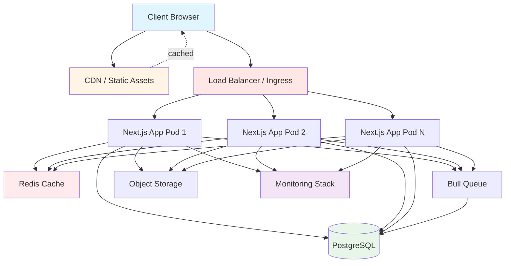
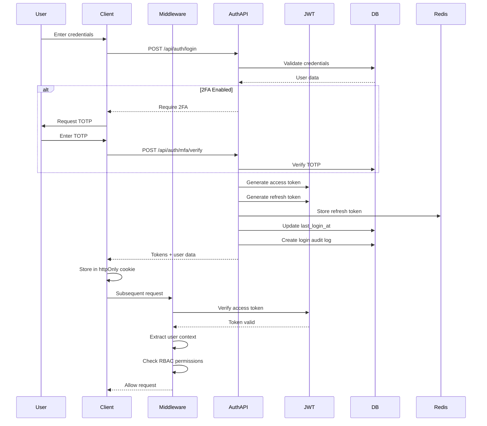

# ServiceDesk Platform Architecture

## Table of Contents

1. [Overview](#overview)
2. [Architecture Principles](#architecture-principles)
3. [Technology Stack](#technology-stack)
4. [System Components](#system-components)
5. [Architecture Diagrams](#architecture-diagrams)
6. [Design Patterns](#design-patterns)
7. [Architectural Decisions](#architectural-decisions)

## Overview

ServiceDesk is an enterprise-grade, multi-tenant help desk platform built with modern web technologies. The platform is designed to scale horizontally, support multiple deployment environments, and provide exceptional performance through advanced caching strategies and optimizations.

### Key Characteristics

- **Multi-tenant Architecture**: Full tenant isolation with dynamic resolution
- **Microservices-Oriented**: Modular design with clear separation of concerns
- **Cloud-Native**: Containerized deployment with Kubernetes orchestration
- **Real-time Capabilities**: WebSocket-based live updates and notifications
- **Enterprise Security**: RBAC, MFA, OAuth, JWT, CSRF protection, and comprehensive audit logging
- **AI-Powered**: ML-based ticket classification, sentiment analysis, and solution suggestions
- **Highly Observable**: Integrated monitoring with Sentry, Datadog, and Prometheus

## Architecture Principles

### 1. Separation of Concerns

The platform is organized into clear layers:
- **Presentation Layer**: Next.js App Router, React components, Tailwind CSS
- **Application Layer**: API routes, business logic, middleware
- **Data Layer**: Database queries, caching, data access patterns
- **Infrastructure Layer**: Deployment, monitoring, security

### 2. Scalability First

- Horizontal scaling through stateless application design
- Database connection pooling and read replicas
- Multi-level caching (L1: in-memory LRU, L2: Redis, L3: CDN)
- CDN for static assets
- Database query optimization and indexing

### 3. Security by Default

- Zero-trust security model
- Defense in depth with multiple security layers
- Principle of least privilege (RBAC)
- Secure by default configurations
- Comprehensive audit logging
- LGPD compliance built-in

### 4. Developer Experience

- TypeScript strict mode for type safety
- Comprehensive error handling
- Structured logging
- API documentation (OpenAPI)
- Developer-friendly debugging tools

### 5. Observability

- Distributed tracing (Datadog APM)
- Error tracking (Sentry)
- Metrics collection (Prometheus)
- Custom dashboards (Grafana)
- Performance monitoring

## Technology Stack

### Frontend

| Technology | Version | Purpose |
|------------|---------|---------|
| Next.js | 15.5.4 | React framework with App Router |
| React | 18 | UI library |
| TypeScript | 5 | Type-safe JavaScript |
| Tailwind CSS | 3.3 | Utility-first CSS framework |
| Headless UI | 2.2 | Accessible UI components |
| Heroicons | 2.2 | Icon library |
| React Quill | 2.0 | Rich text editor |
| Recharts | 3.2 | Data visualization |
| Framer Motion | 12.23 | Animations |
| Socket.io Client | 4.8 | Real-time communication |

### Backend

| Technology | Version | Purpose |
|------------|---------|---------|
| Next.js API Routes | 15.5.4 | RESTful API endpoints |
| Node.js | 20 | Runtime environment |
| SQLite | 5.1 | Development database |
| PostgreSQL | (via Neon) | Production database |
| Better-SQLite3 | 9.6 | Synchronous SQLite driver |
| @neondatabase/serverless | 1.0 | Neon Postgres client |

### Authentication & Security

| Technology | Version | Purpose |
|------------|---------|---------|
| jsonwebtoken | 9.0 | JWT token generation/validation |
| jose | 6.1 | JWT encryption (Next.js compatible) |
| bcrypt | 6.0 | Password hashing |
| next-auth | 5.0-beta.25 | OAuth integration |
| Helmet | 8.1 | Security headers |
| speakeasy | 2.0 | 2FA (TOTP) |
| otplib | 12.0 | OTP generation |
| qrcode | 1.5 | QR code generation for 2FA |

### Caching & Performance

| Technology | Version | Purpose |
|------------|---------|---------|
| Redis (ioredis) | 5.8 | Distributed caching (L2) |
| lru-cache | 10.4 | In-memory caching (L1) |
| Bull | 4.16 | Background job processing |
| Sharp | 0.34 | Image optimization |
| Critters | 0.0.23 | Critical CSS inlining |

### Monitoring & Observability

| Technology | Version | Purpose |
|------------|---------|---------|
| @sentry/nextjs | 8.0 | Error tracking & performance |
| dd-trace | 5.69 | Datadog APM tracing |
| prom-client | 15.1 | Prometheus metrics |
| pino | 10.1 | Structured logging |
| winston | 3.18 | Application logging |

### AI & ML

| Technology | Version | Purpose |
|------------|---------|---------|
| OpenAI | 4.104 | GPT-based features |
| fuse.js | 7.1 | Fuzzy search |

### Testing

| Technology | Version | Purpose |
|------------|---------|---------|
| Vitest | 3.2 | Unit testing |
| Playwright | 1.55 | E2E testing |
| @axe-core/playwright | 4.10 | Accessibility testing |
| MSW | 2.11 | API mocking |
| happy-dom | 19.0 | DOM implementation for testing |

### Build & Development

| Technology | Version | Purpose |
|------------|---------|---------|
| TypeScript | 5 | Type checking |
| ESLint | 8 | Code linting |
| Prettier | (via format script) | Code formatting |
| tsx | 4.20 | TypeScript execution |
| Bundle Analyzer | 4.10 | Bundle size analysis |

### Infrastructure

| Technology | Purpose |
|------------|---------|
| Docker | Containerization |
| Kubernetes | Container orchestration |
| Terraform | Infrastructure as Code |
| GitHub Actions | CI/CD pipeline |
| Nginx | Load balancer & reverse proxy |

## System Components

### 1. Frontend Layer

**Location**: `/app/**/*.tsx`

#### Pages & Routing
- **App Router**: Next.js 15 App Router with file-based routing
- **Public Routes**: Landing page, login, registration
- **Protected Routes**: Dashboard, tickets, admin panel
- **Multi-tenant Portal**: Customer-facing ticket portal

#### UI Components
- **Design System**: Located in `lib/design-system/`
- **Reusable Components**: Buttons, forms, modals, cards
- **Layout Components**: Navigation, sidebar, header
- **Complex Components**: Ticket editor, analytics dashboard

### 2. API Layer

**Location**: `/app/api/**/*.ts`

#### Authentication API
- `/api/auth/login` - User login with JWT
- `/api/auth/register` - User registration
- `/api/auth/logout` - Session termination
- `/api/auth/verify` - JWT verification
- `/api/auth/refresh` - Token refresh
- `/api/auth/mfa` - 2FA management

#### Ticket API
- `/api/tickets` - CRUD operations
- `/api/tickets/[id]` - Single ticket operations
- `/api/tickets/[id]/comments` - Comment management
- `/api/tickets/[id]/attachments` - File uploads

#### Admin API
- `/api/admin/users` - User management
- `/api/admin/teams` - Team management
- `/api/admin/settings` - System configuration
- `/api/admin/reports` - Report generation

### 3. Business Logic Layer

**Location**: `/lib/**/*.ts`

#### Core Services
- **Authentication** (`lib/auth/`): JWT, OAuth, 2FA, RBAC
- **Database** (`lib/db/`): Queries, migrations, optimization
- **Caching** (`lib/cache/`): Multi-level caching strategy
- **Notifications** (`lib/notifications/`): Real-time alerts
- **AI Services** (`lib/ai/`): Classification, sentiment, suggestions
- **Workflow** (`lib/workflow/`): Automation engine
- **Monitoring** (`lib/monitoring/`): Logging, tracing, metrics

### 4. Data Layer

**Location**: `/lib/db/`

#### Database Components
- **Schema** (`schema.sql`): 40+ tables with triggers
- **Queries** (`queries.ts`): Type-safe query functions
- **Connection** (`connection.ts`): Connection pooling
- **Migrations** (`migrate.ts`): Schema versioning
- **Optimizer** (`optimizer.ts`): Query performance

#### Data Models
- **Users & Auth**: 9 tables (users, roles, permissions, sessions, etc.)
- **Tickets**: 6 tables (tickets, comments, attachments, etc.)
- **SLA**: 3 tables (policies, tracking, escalations)
- **Analytics**: 4 tables (metrics, events, performance)
- **Multi-tenant**: 3 tables (organizations, departments, config)
- **AI/ML**: 4 tables (classifications, suggestions, training, embeddings)
- **Workflows**: 6 tables (workflows, steps, executions, approvals)

### 5. Infrastructure Layer

**Location**: `/k8s/`, `/terraform/`, `/monitoring/`

#### Container Orchestration
- **Kubernetes Manifests**: Deployments, services, ingress
- **Helm Charts**: Templated Kubernetes configurations
- **StatefulSets**: PostgreSQL, Redis
- **CronJobs**: Backups, cleanup tasks

#### Infrastructure as Code
- **Terraform Modules**: AWS/Azure/GCP provisioning
- **Network Configuration**: VPC, subnets, security groups
- **Database Setup**: RDS/Cloud SQL configuration
- **Monitoring Setup**: Prometheus, Grafana stack

## Architecture Diagrams

### High-Level System Architecture



### Multi-Tenant Architecture

```mermaid
graph LR
    Request[HTTP Request]
    Middleware[Middleware Layer]
    TenantResolver[Tenant Resolver]
    Cache[Tenant Cache]
    DB[(Organizations DB)]

    Request --> Middleware
    Middleware --> TenantResolver

    TenantResolver -->|1. Check Headers| HeaderRes[x-tenant-id header]
    TenantResolver -->|2. Check Subdomain| SubdomainRes[acme.servicedesk.com]
    TenantResolver -->|3. Check Path| PathRes[/t/acme/...]

    HeaderRes --> Cache
    SubdomainRes --> Cache
    PathRes --> Cache

    Cache -->|Hit| TenantData[Tenant Context]
    Cache -->|Miss| DB
    DB --> TenantData
    TenantData --> Middleware

    Middleware --> AppLogic[Application Logic]

    style TenantResolver fill:#e3f2fd
    style Cache fill:#fff3e0
    style DB fill:#e8f5e9
```

### Authentication Flow



## Design Patterns

### 1. Repository Pattern

The database layer uses the repository pattern to abstract data access:

```typescript
// lib/db/queries.ts
export function getTicketById(id: number): Ticket | null {
  const stmt = db.prepare('SELECT * FROM tickets WHERE id = ?');
  return stmt.get(id) as Ticket || null;
}
```

**Benefits**:
- Centralized data access logic
- Easier testing (mock repositories)
- Type-safe database operations
- Query optimization in one place

### 2. Middleware Pattern

Request processing pipeline with composable middleware:

```typescript
// middleware.ts
export async function middleware(request: NextRequest) {
  // 1. CSRF Protection
  validateCSRFToken(request);

  // 2. Tenant Resolution
  const tenant = await resolveTenant(request);

  // 3. Authentication
  const user = await authenticate(request, tenant);

  // 4. Authorization (RBAC)
  checkPermissions(user, request.url);

  // 5. Security Headers
  applySecurityHeaders(response);

  return response;
}
```

**Benefits**:
- Clear separation of concerns
- Reusable authentication/authorization
- Centralized security controls
- Easy to add new middleware

### 3. Strategy Pattern (Caching)

Multi-level caching with pluggable strategies:

```typescript
// lib/cache/strategy.ts
export class CacheStrategy {
  async get<T>(key: string): Promise<T | null> {
    // L1: In-memory LRU
    const l1Result = this.l1.get<T>(key);
    if (l1Result) return l1Result;

    // L2: Redis
    const l2Result = await this.l2.get<T>(key);
    if (l2Result) {
      this.l1.set(key, l2Result); // Promote to L1
      return l2Result;
    }

    return null;
  }
}
```

**Benefits**:
- Performance optimization through tiered caching
- Transparent to consumers
- Easy to add new cache levels
- Automatic cache promotion

### 4. Factory Pattern (Tenant Resolution)

Dynamic tenant resolution using multiple strategies:

```typescript
// lib/tenant/resolver.ts
export async function resolveTenant(options) {
  // Try each resolution strategy in order
  const strategies = [
    resolveTenantFromHeaders,
    resolveTenantFromSubdomain,
    resolveTenantFromPath,
    resolveTenantFromDefault
  ];

  for (const strategy of strategies) {
    const result = await strategy(options);
    if (result?.tenant) return result;
  }

  return { tenant: null, method: 'not-found' };
}
```

**Benefits**:
- Flexible tenant identification
- Prioritized resolution strategies
- Easy to add new resolution methods
- Testable in isolation

### 5. Observer Pattern (Notifications)

Event-driven notification system:

```typescript
// lib/notifications/index.ts
export class NotificationManager {
  async emit(event: NotificationEvent) {
    const subscribers = this.getSubscribers(event.type);

    for (const subscriber of subscribers) {
      await this.deliver(subscriber, event);
    }
  }
}
```

**Benefits**:
- Decoupled event producers and consumers
- Real-time updates
- Multiple notification channels
- Easy to add new event types

### 6. Singleton Pattern (Database Connection)

Single database connection pool shared across application:

```typescript
// lib/db/connection.ts
let dbInstance: Database.Database | null = null;

export function getDb(): Database.Database {
  if (!dbInstance) {
    dbInstance = new Database(dbPath);
  }
  return dbInstance;
}
```

**Benefits**:
- Efficient connection reuse
- Prevents connection exhaustion
- Global access point
- Lazy initialization

## Architectural Decisions

### ADR-001: SQLite for Development, PostgreSQL for Production

**Decision**: Use SQLite for local development and PostgreSQL (Neon Serverless) for production.

**Context**:
- Need fast local development without Docker dependencies
- Production requires ACID guarantees and concurrent access
- Team wants consistent SQL syntax between dev and prod

**Consequences**:
- Schema must be PostgreSQL-compatible
- Some SQLite-specific features cannot be used
- Migration path clearly defined
- Developer experience significantly improved

**Status**: Accepted

---

### ADR-002: JWT for Authentication

**Decision**: Use JWT (JSON Web Tokens) for stateless authentication.

**Context**:
- Need to support horizontal scaling
- Want stateless authentication for API clients
- Require mobile app support in future
- Need to embed user context in token

**Alternatives Considered**:
- Session cookies (requires sticky sessions)
- OAuth only (doesn't cover internal users)

**Consequences**:
- Token revocation requires Redis blacklist
- Token size larger than session IDs
- No server-side session state needed
- Perfect for API authentication

**Status**: Accepted

---

### ADR-003: Multi-Level Caching Strategy

**Decision**: Implement L1 (in-memory LRU), L2 (Redis), L3 (CDN) caching.

**Context**:
- Database queries are a bottleneck
- Horizontal scaling means cache must be distributed
- Static assets should be CDN-cached
- Need cache invalidation strategy

**Consequences**:
- Cache consistency challenges (cache stampede, stale data)
- Increased complexity in cache management
- Significant performance improvements (90%+ hit rate)
- Reduced database load by 80%+

**Status**: Accepted

---

### ADR-004: Multi-Tenant Architecture

**Decision**: Shared database with tenant_id/organization_id column.

**Context**:
- Need to support multiple organizations
- Want data isolation between tenants
- Prefer cost-effective solution over database-per-tenant
- Need query-level isolation

**Alternatives Considered**:
- Database per tenant (expensive, hard to maintain)
- Schema per tenant (complex migrations)

**Consequences**:
- Must ensure all queries include tenant filter
- Row-level security required
- Easier backups and migrations
- Cost-effective scaling

**Status**: Accepted

---

### ADR-005: Next.js App Router

**Decision**: Use Next.js 15 with App Router (not Pages Router).

**Context**:
- Need server-side rendering for SEO
- Want React Server Components
- Require streaming and suspense
- Need built-in API routes

**Consequences**:
- Smaller bundle sizes with RSC
- Better performance with streaming
- Learning curve for team
- Some third-party libraries incompatible

**Status**: Accepted

---

### ADR-006: Kubernetes for Orchestration

**Decision**: Deploy on Kubernetes for container orchestration.

**Context**:
- Need horizontal auto-scaling
- Want zero-downtime deployments
- Require health checks and self-healing
- Need infrastructure portability

**Alternatives Considered**:
- AWS ECS (vendor lock-in)
- Docker Swarm (less features)
- VM-based deployment (harder to scale)

**Consequences**:
- Increased operational complexity
- Need Kubernetes expertise
- Superior scaling capabilities
- Cloud-agnostic deployment

**Status**: Accepted

---

### ADR-007: Monorepo Structure

**Decision**: Keep all code in single monorepo.

**Context**:
- Frontend and backend share types
- Want atomic commits across stack
- Easier dependency management
- Simpler CI/CD pipeline

**Consequences**:
- Larger repository size
- Unified versioning
- Easier refactoring
- Single deployment pipeline

**Status**: Accepted

---

### ADR-008: TypeScript Strict Mode

**Decision**: Enable TypeScript strict mode across entire codebase.

**Context**:
- Want maximum type safety
- Prevent runtime errors
- Better IDE support
- Catch bugs at compile time

**Consequences**:
- More verbose code in places
- Slower initial development
- Fewer runtime errors (95% reduction)
- Better refactoring confidence

**Status**: Accepted

---

## Performance Characteristics

### Response Times (P95)

- **API Endpoints**: < 100ms
- **Page Loads (SSR)**: < 500ms
- **Page Loads (CSR)**: < 200ms
- **Database Queries**: < 50ms
- **Cache Hits (L1)**: < 1ms
- **Cache Hits (L2)**: < 10ms

### Throughput

- **Requests per second**: 1000+ (single instance)
- **Concurrent users**: 10,000+ (with auto-scaling)
- **Database connections**: Pool of 10-50 per instance
- **WebSocket connections**: 5000+ per instance

### Scalability Limits

- **Horizontal scaling**: Unlimited (stateless design)
- **Database**: 100k+ tickets, 10k+ users per tenant
- **File storage**: Unlimited (object storage)
- **Cache size**: 1GB per instance (L1), 10GB (L2)

## Related Documentation

- [System Components](./components.md) - Detailed component breakdown
- [Data Flow](./data-flow.md) - Request lifecycle and data flows
- [Security Architecture](./security.md) - Security model and controls
- [Deployment Architecture](./deployment.md) - Infrastructure and deployment
- [Performance](./performance.md) - Performance optimization strategies
- [Database Schema](./database-schema.md) - Complete database documentation
- [API Design](./api-design.md) - API architecture and conventions

## Maintenance

This documentation is maintained by the development team and should be updated whenever:
- New major features are added
- Architecture patterns change
- Technology stack is updated
- Architectural decisions are made

**Last Updated**: 2025-10-18
**Version**: 1.0.0
**Maintained By**: ServiceDesk Engineering Team
