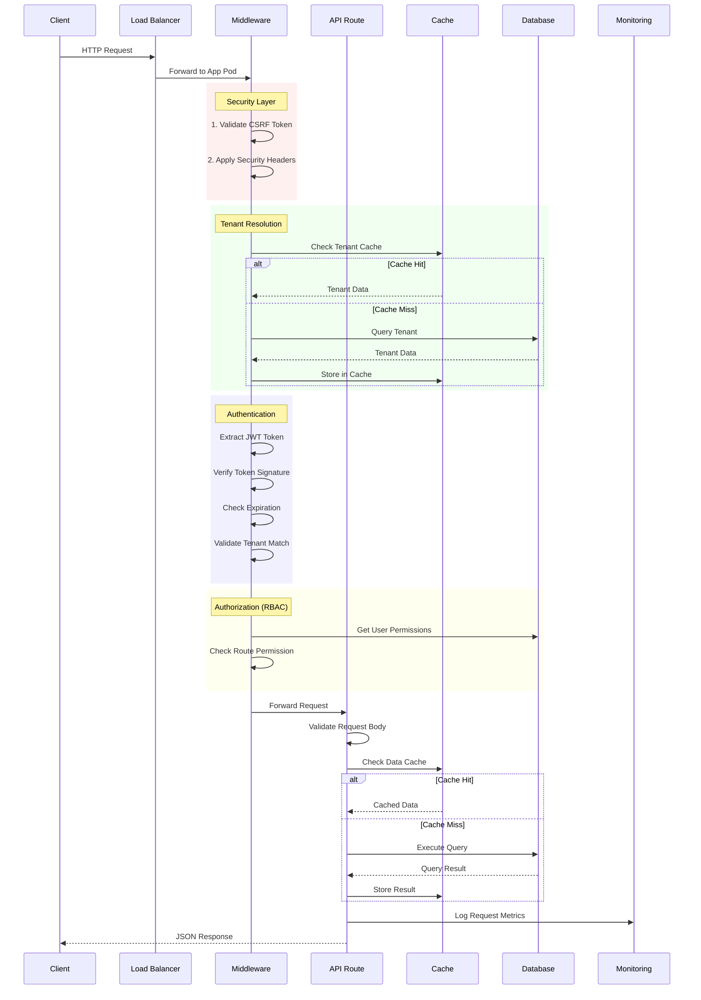
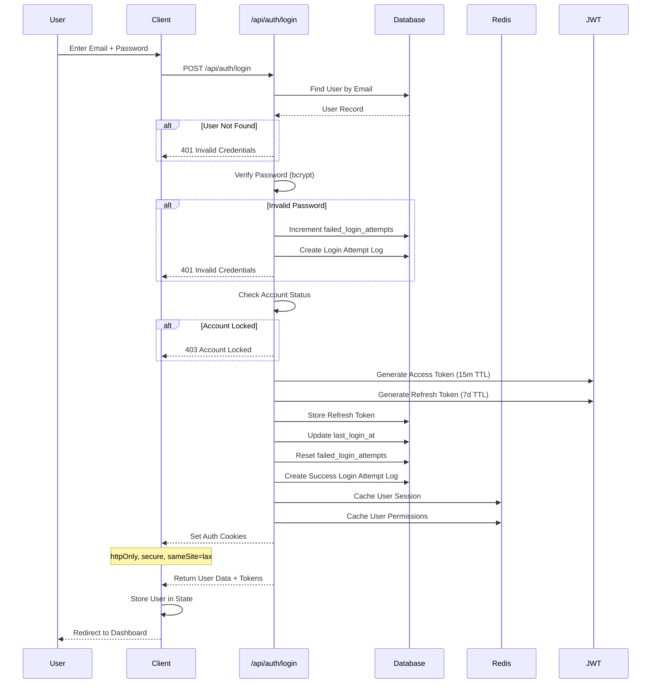
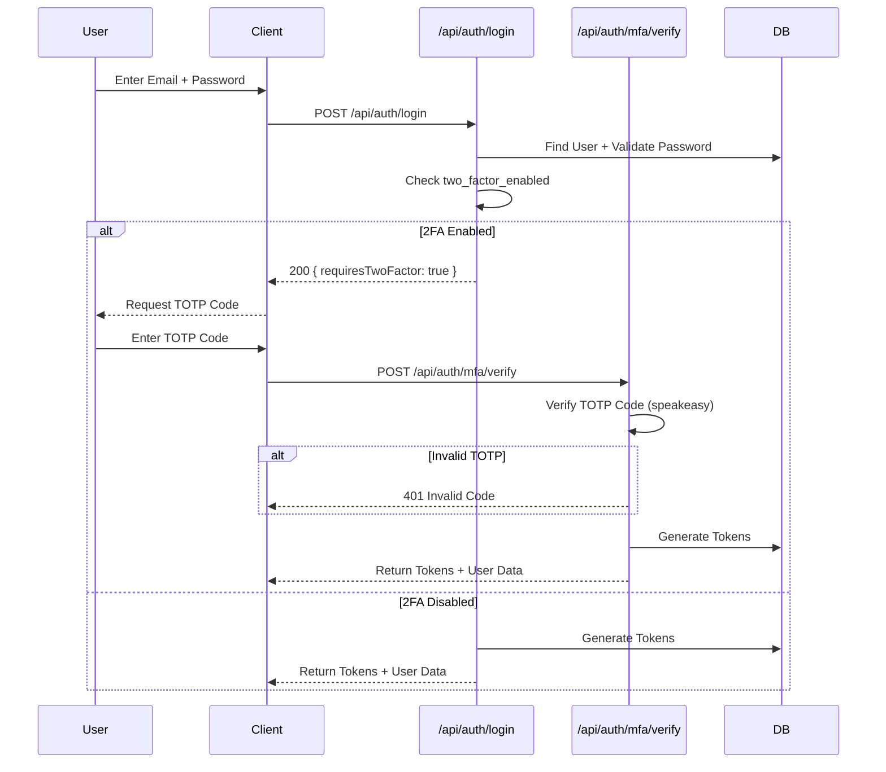
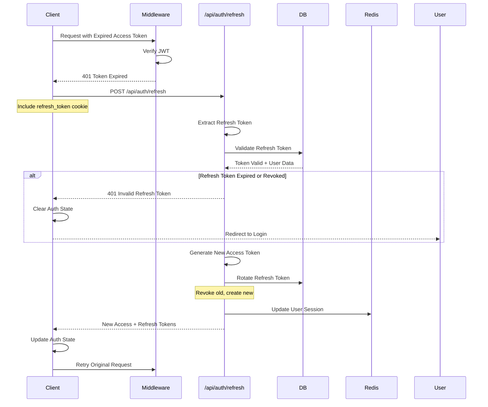
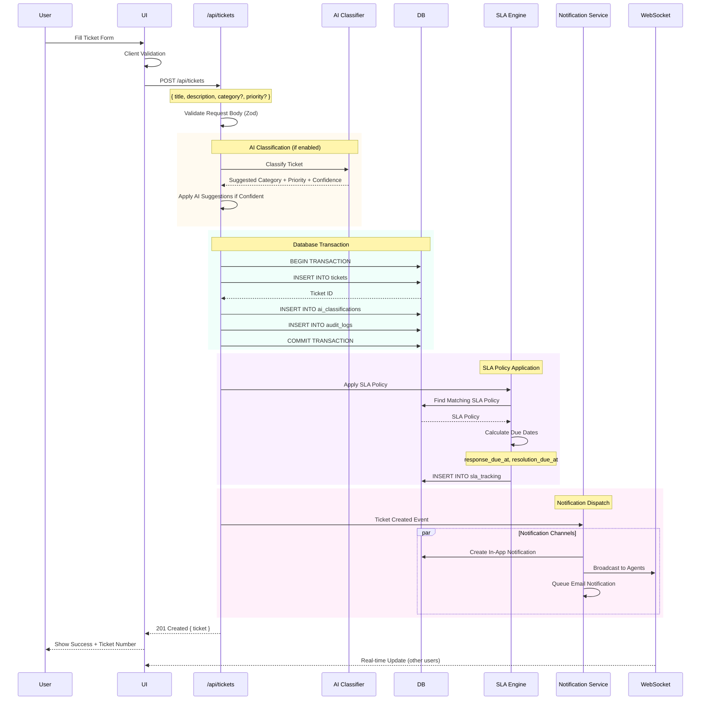
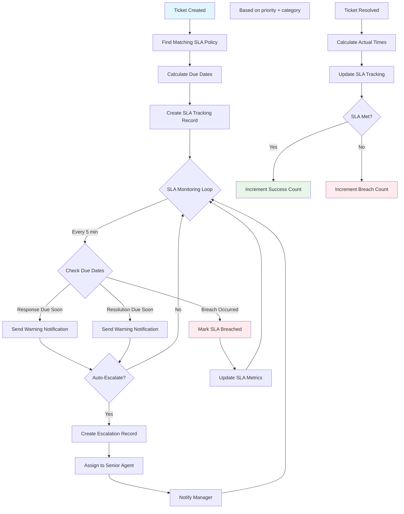
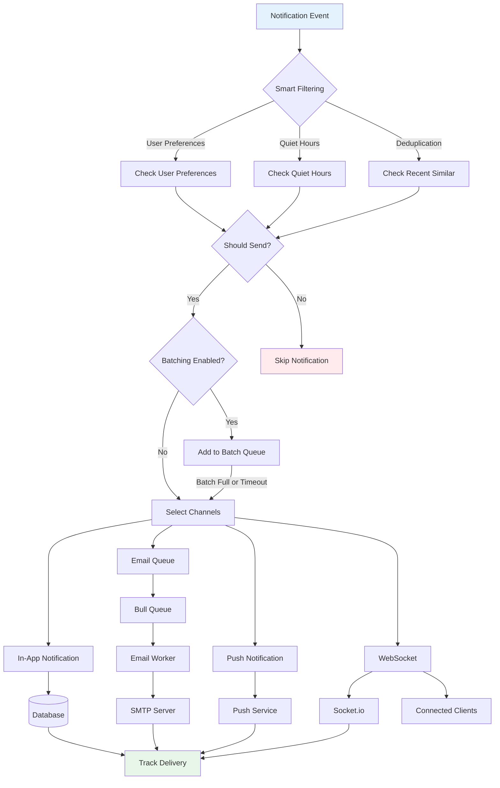
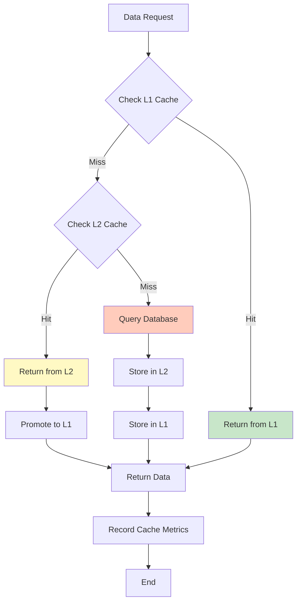
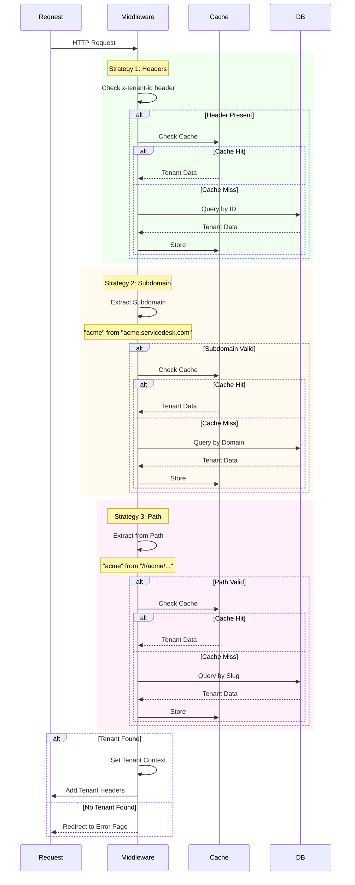

# Data Flow Architecture

## Table of Contents

1. [Request Lifecycle](#request-lifecycle)
2. [Authentication Flow](#authentication-flow)
3. [Ticket Creation Flow](#ticket-creation-flow)
4. [SLA Tracking Flow](#sla-tracking-flow)
5. [Notification Flow](#notification-flow)
6. [Caching Flow](#caching-flow)
7. [Multi-Tenant Data Flow](#multi-tenant-data-flow)

## Request Lifecycle

### Complete Request Processing Pipeline



### Middleware Processing Steps

```typescript
// middleware.ts - Step-by-step processing
export async function middleware(request: NextRequest) {
  const startTime = performance.now();

  // Step 1: CSRF Protection (state-changing requests)
  if (['POST', 'PUT', 'PATCH', 'DELETE'].includes(request.method)) {
    if (!validateCSRFToken(request)) {
      return errorResponse('CSRF validation failed', 403);
    }
  }

  // Step 2: Tenant Resolution
  const tenantResult = await resolveTenant({
    hostname: request.headers.get('host'),
    pathname: request.nextUrl.pathname,
    headers: Object.fromEntries(request.headers)
  });

  if (!tenantResult.tenant && requiresTenant(pathname)) {
    return redirectToTenantNotFound();
  }

  // Step 3: Authentication
  if (requiresAuth(pathname)) {
    const authResult = await checkAuthentication(request, tenantResult.tenant);

    if (!authResult.authenticated) {
      return redirectToLogin();
    }

    // Step 4: Authorization (RBAC)
    if (requiresAdminAccess(pathname)) {
      if (!checkAdminAccess(authResult.user, tenantResult.tenant)) {
        return errorResponse('Insufficient permissions', 403);
      }
    }

    // Set user context in headers
    response.headers.set('x-user-id', authResult.user.id);
    response.headers.set('x-user-role', authResult.user.role);
  }

  // Step 5: Performance Tracking
  const processingTime = performance.now() - startTime;
  response.headers.set('X-Response-Time', `${processingTime}ms`);

  // Step 6: Security Headers
  applySecurityHeaders(response);

  return response;
}
```

## Authentication Flow

### Login Flow (Without 2FA)



### Login Flow (With 2FA)



### JWT Token Refresh Flow



## Ticket Creation Flow

### Complete Ticket Lifecycle



### AI Classification Detail

```typescript
// lib/ai/ticket-classifier.ts
export async function classifyTicket(ticket: {
  title: string;
  description: string;
}): Promise<AIClassification> {
  // 1. Prepare prompt
  const prompt = `
    Classify this support ticket:
    Title: ${ticket.title}
    Description: ${ticket.description}

    Available categories: ${categories.join(', ')}
    Available priorities: Low, Medium, High, Critical

    Return JSON with:
    - category: string
    - priority: string
    - confidence: number (0-1)
    - reasoning: string
  `;

  // 2. Call OpenAI
  const response = await openai.chat.completions.create({
    model: 'gpt-4',
    messages: [
      { role: 'system', content: 'You are a ticket classifier.' },
      { role: 'user', content: prompt }
    ],
    response_format: { type: 'json_object' }
  });

  // 3. Parse result
  const result = JSON.parse(response.choices[0].message.content);

  // 4. Store classification
  await storeClassification({
    ticket_id: ticket.id,
    model_name: 'gpt-4',
    suggested_category: result.category,
    suggested_priority: result.priority,
    confidence_score: result.confidence,
    reasoning: result.reasoning
  });

  return result;
}
```

## SLA Tracking Flow

### Automatic SLA Management



### SLA Calculation Logic

```typescript
// lib/workflow/automation-engine.ts
export async function applySLAPolicy(ticket: Ticket) {
  // 1. Find matching SLA policy
  const policy = await getSLAPolicy(ticket.priority_id, ticket.category_id);

  if (!policy) {
    // No SLA policy for this combination
    return;
  }

  // 2. Calculate due dates
  const now = new Date();
  const response_due_at = addMinutes(now, policy.response_time_minutes);
  const resolution_due_at = addMinutes(now, policy.resolution_time_minutes);

  // Handle business hours
  if (policy.business_hours_only) {
    response_due_at = nextBusinessTime(response_due_at);
    resolution_due_at = nextBusinessTime(resolution_due_at);
  }

  // 3. Create SLA tracking record
  await createSLATracking({
    ticket_id: ticket.id,
    sla_policy_id: policy.id,
    response_due_at,
    resolution_due_at,
    escalation_due_at: policy.escalation_time_minutes
      ? addMinutes(now, policy.escalation_time_minutes)
      : null
  });

  // 4. Schedule SLA monitoring job
  await scheduleSLACheck(ticket.id, response_due_at, resolution_due_at);
}
```

## Notification Flow

### Multi-Channel Notification System



### Notification Channel Selection

```typescript
// lib/notifications/channels.ts
export async function sendNotification(notification: Notification) {
  const user = await getUser(notification.user_id);
  const preferences = await getUserNotificationPreferences(user.id);

  // Smart filtering
  if (await shouldSkipNotification(notification, preferences)) {
    return;
  }

  // Channel selection based on preferences
  const channels: NotificationChannel[] = [];

  // In-app (always)
  channels.push('in_app');

  // Email (if enabled and not in quiet hours)
  if (preferences.email_enabled && !isQuietHours(user.timezone)) {
    channels.push('email');
  }

  // Push (if enabled and device registered)
  if (preferences.push_enabled && await hasRegisteredDevice(user.id)) {
    channels.push('push');
  }

  // WebSocket (if user is online)
  if (await isUserOnline(user.id)) {
    channels.push('websocket');
  }

  // Dispatch to all selected channels
  await Promise.all(
    channels.map(channel => deliverNotification(notification, channel))
  );
}
```

## Caching Flow

### Multi-Level Cache Strategy



### Cache-Aside Pattern Implementation

```typescript
// lib/cache/strategy.ts
export class CacheStrategy {
  async getOrSet<T>(
    key: string,
    fetcher: () => Promise<T>,
    options: CacheOptions = {}
  ): Promise<T> {
    // Try L1 cache (in-memory LRU)
    const l1Result = this.l1.get<T>(key);
    if (l1Result !== null) {
      this.recordHit('l1');
      return l1Result;
    }

    // Try L2 cache (Redis)
    const l2Result = await this.l2.get<T>(key);
    if (l2Result !== null) {
      // Promote to L1
      this.l1.set(key, l2Result, options);
      this.recordHit('l2');
      return l2Result;
    }

    // Cache miss - fetch from source
    this.recordMiss();
    const data = await fetcher();

    // Store in both cache levels
    await this.set(key, data, options);

    return data;
  }

  async set<T>(key: string, data: T, options: CacheOptions): Promise<void> {
    // Set in L1 (sync)
    this.l1.set(key, data, options);

    // Set in L2 (async)
    await this.l2.set(key, data, options);

    // Tag-based invalidation support
    if (options.tags) {
      await this.indexTags(key, options.tags);
    }
  }
}
```

### Cache Invalidation Patterns

```typescript
// Event-driven cache invalidation
eventBus.on('ticket:updated', async (ticketId, organizationId) => {
  // Invalidate specific ticket
  await cache.delete(`ticket:${ticketId}`);

  // Invalidate by tags
  await cache.invalidateByTag(`org:${organizationId}:tickets`);
  await cache.invalidateByTag(`ticket:${ticketId}`);

  // Invalidate list views
  await cache.invalidateByPattern(`tickets:list:*`);
});

eventBus.on('user:role-changed', async (userId) => {
  // Invalidate user permissions cache
  await cache.delete(`user:${userId}:permissions`);
  await cache.delete(`user:${userId}:roles`);
});
```

## Multi-Tenant Data Flow

### Tenant Resolution Pipeline



### Tenant Data Isolation

```typescript
// All database queries automatically filtered by organization_id

// Example: Get tickets (automatically filtered)
export function getTickets(organizationId: number, filters?: TicketFilters) {
  const stmt = db.prepare(`
    SELECT t.*
    FROM tickets t
    WHERE t.organization_id = ?
      AND (? IS NULL OR t.status_id = ?)
      AND (? IS NULL OR t.priority_id = ?)
      AND (? IS NULL OR t.assigned_to = ?)
    ORDER BY t.created_at DESC
  `);

  return stmt.all(
    organizationId,
    filters?.status_id, filters?.status_id,
    filters?.priority_id, filters?.priority_id,
    filters?.assigned_to, filters?.assigned_to
  ) as Ticket[];
}

// Middleware enforcement - sets organization context
export async function middleware(request: NextRequest) {
  const tenant = await resolveTenant(request);

  // CRITICAL: Set tenant context for all downstream operations
  request.headers.set('x-organization-id', tenant.id.toString());

  // All API routes can access via:
  // const orgId = parseInt(request.headers.get('x-organization-id'));
}
```

## Performance Metrics

### Typical Response Times

| Operation | L1 Cache | L2 Cache | Database | Total |
|-----------|----------|----------|----------|-------|
| Get Ticket | 0.5ms | 8ms | 45ms | 0.5-45ms |
| List Tickets | 1ms | 12ms | 80ms | 1-80ms |
| Create Ticket | N/A | N/A | 50ms | 50ms |
| User Login | 2ms | 15ms | 120ms | 2-120ms |
| Get Categories | 0.3ms | 5ms | 20ms | 0.3-20ms |

### Cache Hit Rates (Target)

- **L1 Cache**: 40-60% hit rate
- **L2 Cache**: 30-40% hit rate
- **Overall**: 85-95% cache hit rate
- **Average Response**: 5-15ms (cached), 50-200ms (uncached)

### Database Query Performance

- **Simple Queries** (<100 rows): < 50ms
- **Complex Queries** (joins, aggregations): < 200ms
- **Analytics Queries**: < 500ms
- **Batch Operations**: < 1s (1000 records)

---

**Last Updated**: 2025-10-18
**Version**: 1.0.0
