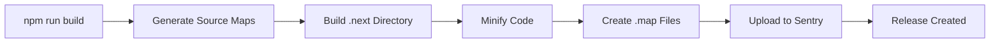

# Sentry Source Maps Configuration Guide

## Overview

This guide explains how to configure and use Sentry source maps for the ServiceDesk application. Source maps enable Sentry to provide readable stack traces for production errors by mapping minified code back to original source code.

## 🎯 What Are Source Maps?

Source maps are files that map minified/compiled JavaScript code back to the original source code. They allow:

- **Readable stack traces** in production error reports
- **Exact line numbers** pointing to original source files
- **Variable names** from your source code (not minified versions)
- **Better debugging** of production issues

## 📋 Table of Contents

1. [Configuration Files](#configuration-files)
2. [Environment Variables](#environment-variables)
3. [Build Configuration](#build-configuration)
4. [Upload Process](#upload-process)
5. [CI/CD Integration](#cicd-integration)
6. [Troubleshooting](#troubleshooting)
7. [Security Best Practices](#security-best-practices)

---

## 1. Configuration Files

### 1.1 Next.js Configuration (`next.config.js`)

The build is configured to generate source maps in production:

```javascript
{
  // Enable source maps for production builds
  productionBrowserSourceMaps: true,

  webpack: (config, { dev, isServer }) => {
    if (!dev) {
      // Use hidden source maps (not referenced in bundle)
      config.devtool = 'hidden-source-map'
    }
    return config
  }
}
```

**Key Points:**
- `productionBrowserSourceMaps: true` - Generates source maps during build
- `hidden-source-map` - Creates source maps without referencing them in bundles
- Source maps are NOT served to users (security feature)

### 1.2 Sentry CLI Configuration (`.sentryclirc`)

Located at project root. **IMPORTANT:** This file contains sensitive tokens.

```ini
[auth]
token=YOUR_SENTRY_AUTH_TOKEN_HERE

[defaults]
org=YOUR_ORGANIZATION_SLUG
project=YOUR_PROJECT_SLUG

[sourcemaps]
auto-upload=true
delete=false
url-prefix=~/_next/
```

**Security Warning:**
- Add `.sentryclirc` to `.gitignore`
- Never commit authentication tokens
- Use environment variables in CI/CD instead

---

## 2. Environment Variables

### 2.1 Required Variables

Add these to your `.env` file (use `.env.example` as template):

```bash
# Public DSN (safe to expose in client code)
SENTRY_DSN=https://xxxxx@xxxxx.ingest.sentry.io/xxxxx

# Authentication (KEEP SECRET!)
SENTRY_AUTH_TOKEN=sntrys_xxxxxxxxxxxxxxxxxxxxxxxxxxxx

# Organization & Project
SENTRY_ORG=your-organization-slug
SENTRY_PROJECT=servicedesk

# Environment
SENTRY_ENVIRONMENT=production

# Release identifier (auto-generated if empty)
SENTRY_RELEASE=

# Enable source map upload
SENTRY_UPLOAD_SOURCEMAPS=true
```

### 2.2 Getting Your Credentials

#### Sentry DSN
1. Go to **Sentry Dashboard** → **Settings** → **Projects**
2. Select your project
3. Navigate to **Client Keys (DSN)**
4. Copy the DSN URL

#### Authentication Token
1. Go to **Settings** → **Account** → **API** → **Auth Tokens**
2. Click **Create New Token**
3. Required scopes:
   - `project:read`
   - `project:releases`
   - `org:read`
4. Copy the token immediately (shown only once)

#### Organization & Project Slugs
Found in your Sentry URL:
```
https://sentry.io/organizations/[ORG_SLUG]/projects/[PROJECT_SLUG]/
```

---

## 3. Build Configuration

### 3.1 Build Process Flow



### 3.2 NPM Scripts

Available scripts in `package.json`:

```json
{
  "scripts": {
    // Upload all source maps
    "sentry:sourcemaps": "sentry-cli sourcemaps upload --org $SENTRY_ORG --project $SENTRY_PROJECT .next",

    // Upload client-side source maps only
    "sentry:sourcemaps:client": "sentry-cli sourcemaps upload --org $SENTRY_ORG --project $SENTRY_PROJECT .next/static/chunks",

    // Upload server-side source maps only
    "sentry:sourcemaps:server": "sentry-cli sourcemaps upload --org $SENTRY_ORG --project $SENTRY_PROJECT .next/server",

    // Create a new release with commits
    "sentry:release": "sentry-cli releases new $SENTRY_RELEASE && sentry-cli releases set-commits $SENTRY_RELEASE --auto && sentry-cli releases finalize $SENTRY_RELEASE",

    // Full deployment workflow
    "sentry:deploy": "npm run build && npm run sentry:sourcemaps && npm run sentry:release",

    // Auto-upload after build (requires script)
    "postbuild": "node scripts/sentry-upload-sourcemaps.js"
  }
}
```

---

## 4. Upload Process

### 4.1 Manual Upload

For local testing or one-off deployments:

```bash
# Step 1: Build the application
npm run build

# Step 2: Set environment variables
export SENTRY_AUTH_TOKEN="your-token-here"
export SENTRY_ORG="your-org"
export SENTRY_PROJECT="servicedesk"
export SENTRY_RELEASE="$(git rev-parse --short HEAD)"

# Step 3: Upload source maps
npm run sentry:sourcemaps

# Step 4: Create release
npm run sentry:release
```

### 4.2 Automated Upload (Recommended)

Create `scripts/sentry-upload-sourcemaps.js`:

```javascript
#!/usr/bin/env node

const { execSync } = require('child_process');
const fs = require('fs');
const path = require('path');

// Check if source maps should be uploaded
const shouldUpload = process.env.SENTRY_UPLOAD_SOURCEMAPS === 'true';
const authToken = process.env.SENTRY_AUTH_TOKEN;
const org = process.env.SENTRY_ORG;
const project = process.env.SENTRY_PROJECT;
const release = process.env.SENTRY_RELEASE || execSync('git rev-parse --short HEAD').toString().trim();

if (!shouldUpload) {
  console.log('ℹ️  Source map upload disabled (SENTRY_UPLOAD_SOURCEMAPS != true)');
  process.exit(0);
}

if (!authToken || !org || !project) {
  console.log('⚠️  Missing Sentry configuration. Skipping source map upload.');
  console.log('   Required: SENTRY_AUTH_TOKEN, SENTRY_ORG, SENTRY_PROJECT');
  process.exit(0);
}

console.log('🚀 Uploading source maps to Sentry...');
console.log(`   Organization: ${org}`);
console.log(`   Project: ${project}`);
console.log(`   Release: ${release}`);

try {
  // Create release
  execSync(`sentry-cli releases new ${release}`, { stdio: 'inherit' });

  // Upload source maps
  execSync(`sentry-cli sourcemaps upload --org ${org} --project ${project} .next`, { stdio: 'inherit' });

  // Set commits
  execSync(`sentry-cli releases set-commits ${release} --auto`, { stdio: 'inherit' });

  // Finalize release
  execSync(`sentry-cli releases finalize ${release}`, { stdio: 'inherit' });

  console.log('✅ Source maps uploaded successfully!');
} catch (error) {
  console.error('❌ Source map upload failed:', error.message);
  process.exit(1);
}
```

Make it executable:
```bash
chmod +x scripts/sentry-upload-sourcemaps.js
```

---

## 5. CI/CD Integration

### 5.1 GitHub Actions

Create `.github/workflows/deploy.yml`:

```yaml
name: Deploy with Sentry

on:
  push:
    branches: [main, production]

jobs:
  deploy:
    runs-on: ubuntu-latest

    steps:
      - uses: actions/checkout@v3
        with:
          fetch-depth: 0  # Required for release commits

      - name: Setup Node.js
        uses: actions/setup-node@v3
        with:
          node-version: '20'

      - name: Install dependencies
        run: npm ci

      - name: Build application
        run: npm run build
        env:
          SENTRY_DSN: ${{ secrets.SENTRY_DSN }}
          NODE_ENV: production

      - name: Upload source maps to Sentry
        run: npm run sentry:sourcemaps
        env:
          SENTRY_AUTH_TOKEN: ${{ secrets.SENTRY_AUTH_TOKEN }}
          SENTRY_ORG: ${{ secrets.SENTRY_ORG }}
          SENTRY_PROJECT: ${{ secrets.SENTRY_PROJECT }}
          SENTRY_RELEASE: ${{ github.sha }}

      - name: Create Sentry release
        run: npm run sentry:release
        env:
          SENTRY_AUTH_TOKEN: ${{ secrets.SENTRY_AUTH_TOKEN }}
          SENTRY_ORG: ${{ secrets.SENTRY_ORG }}
          SENTRY_PROJECT: ${{ secrets.SENTRY_PROJECT }}
          SENTRY_RELEASE: ${{ github.sha }}
```

**GitHub Secrets to Configure:**
- `SENTRY_DSN`
- `SENTRY_AUTH_TOKEN`
- `SENTRY_ORG`
- `SENTRY_PROJECT`

### 5.2 Vercel

Add to `vercel.json`:

```json
{
  "build": {
    "env": {
      "SENTRY_DSN": "@sentry-dsn",
      "SENTRY_AUTH_TOKEN": "@sentry-auth-token",
      "SENTRY_ORG": "@sentry-org",
      "SENTRY_PROJECT": "@sentry-project"
    }
  },
  "env": {
    "SENTRY_DSN": "@sentry-dsn"
  }
}
```

Configure environment variables in Vercel dashboard:
1. Go to **Project Settings** → **Environment Variables**
2. Add each Sentry variable for production environment
3. Make `SENTRY_DSN` available to client (not sensitive)
4. Keep `SENTRY_AUTH_TOKEN` server-only (sensitive)

### 5.3 Docker

Update `Dockerfile`:

```dockerfile
# Build stage
FROM node:20-alpine AS builder

WORKDIR /app

# Copy package files
COPY package*.json ./
RUN npm ci

# Copy source code
COPY . .

# Build with source maps
ARG SENTRY_AUTH_TOKEN
ARG SENTRY_ORG
ARG SENTRY_PROJECT
ARG SENTRY_RELEASE

ENV SENTRY_AUTH_TOKEN=$SENTRY_AUTH_TOKEN
ENV SENTRY_ORG=$SENTRY_ORG
ENV SENTRY_PROJECT=$SENTRY_PROJECT
ENV SENTRY_RELEASE=$SENTRY_RELEASE

RUN npm run build

# Production stage
FROM node:20-alpine AS runner

WORKDIR /app

# Copy built files (source maps excluded from final image)
COPY --from=builder /app/.next/standalone ./
COPY --from=builder /app/public ./public
COPY --from=builder /app/.next/static ./.next/static

EXPOSE 3000

CMD ["node", "server.js"]
```

Build command:
```bash
docker build \
  --build-arg SENTRY_AUTH_TOKEN=$SENTRY_AUTH_TOKEN \
  --build-arg SENTRY_ORG=$SENTRY_ORG \
  --build-arg SENTRY_PROJECT=$SENTRY_PROJECT \
  --build-arg SENTRY_RELEASE=$(git rev-parse --short HEAD) \
  -t servicedesk .
```

---

## 6. Troubleshooting

### 6.1 Common Issues

#### Source Maps Not Uploading

**Symptoms:** Build succeeds but no source maps in Sentry

**Solutions:**
```bash
# Check if source maps are generated
ls -la .next/static/chunks/*.map

# Verify environment variables
echo $SENTRY_AUTH_TOKEN
echo $SENTRY_ORG
echo $SENTRY_PROJECT

# Test upload manually
sentry-cli sourcemaps upload --org $SENTRY_ORG --project $SENTRY_PROJECT .next --verbose
```

#### Wrong Stack Traces

**Symptoms:** Sentry shows correct errors but wrong line numbers

**Solutions:**
1. Verify `url-prefix` in `.sentryclirc` matches your deployment URL
2. Check that release version matches between client and upload
3. Ensure source maps match the deployed bundle

#### Authentication Failures

**Symptoms:** `401 Unauthorized` or `403 Forbidden` errors

**Solutions:**
1. Regenerate auth token with correct scopes:
   - `project:read`
   - `project:releases`
   - `org:read`
2. Verify token is set correctly in environment
3. Check organization and project slugs are correct

### 6.2 Debugging Commands

```bash
# List all releases
sentry-cli releases list --org $SENTRY_ORG --project $SENTRY_PROJECT

# Show release files
sentry-cli releases files $SENTRY_RELEASE list --org $SENTRY_ORG --project $SENTRY_PROJECT

# Delete a release (for testing)
sentry-cli releases delete $SENTRY_RELEASE --org $SENTRY_ORG --project $SENTRY_PROJECT

# Test authentication
sentry-cli info

# Validate source map
sentry-cli sourcemaps validate .next/static/chunks/main.js .next/static/chunks/main.js.map
```

---

## 7. Security Best Practices

### 7.1 Secret Management

✅ **DO:**
- Store `SENTRY_AUTH_TOKEN` in secure secret management (GitHub Secrets, AWS Secrets Manager, etc.)
- Use environment variables in CI/CD pipelines
- Rotate auth tokens periodically
- Limit token scopes to minimum required permissions

❌ **DON'T:**
- Commit `.sentryclirc` with real tokens
- Expose auth tokens in client-side code
- Share auth tokens between environments
- Use long-lived tokens in development

### 7.2 Source Map Protection

Source maps should **NEVER** be publicly accessible:

1. **Hidden Source Maps**: Configured in `next.config.js`
   ```javascript
   config.devtool = 'hidden-source-map'
   ```

2. **Server-Side Upload**: Source maps are uploaded from build server, not referenced in bundles

3. **CDN Configuration**: If using CDN, ensure `.map` files are not cached or served

4. **Nginx Example**:
   ```nginx
   # Block access to source maps
   location ~* \.map$ {
     deny all;
     return 404;
   }
   ```

### 7.3 Access Control

Configure Sentry team permissions:
1. **Developers**: Read access to error reports
2. **DevOps**: Write access for releases and uploads
3. **Admins**: Full access to project settings

---

## 8. Verification Checklist

Use this checklist to verify your setup:

### Initial Setup
- [ ] `.sentryclirc` created with placeholder values
- [ ] `.sentryclirc` added to `.gitignore`
- [ ] Environment variables added to `.env.example`
- [ ] Sentry auth token generated with correct scopes
- [ ] Organization and project slugs configured

### Build Configuration
- [ ] `productionBrowserSourceMaps: true` in `next.config.js`
- [ ] `hidden-source-map` configured in webpack
- [ ] Source maps generated during build (check `.next` directory)
- [ ] NPM scripts added for Sentry operations

### Upload Process
- [ ] Environment variables set correctly
- [ ] Source maps upload successfully
- [ ] Releases created in Sentry dashboard
- [ ] Commits associated with releases

### Error Tracking
- [ ] Test error appears in Sentry
- [ ] Stack trace shows original source code
- [ ] Line numbers point to correct locations
- [ ] Variable names are readable (not minified)

### CI/CD Integration
- [ ] GitHub Secrets / Vercel env vars configured
- [ ] Build pipeline includes source map upload
- [ ] Release creation automated
- [ ] Source maps not included in production bundle

### Security
- [ ] Auth tokens stored securely
- [ ] `.map` files not publicly accessible
- [ ] Tokens rotated periodically
- [ ] Team access configured correctly

---

## 9. Quick Reference

### Essential Commands

```bash
# Build and upload (manual)
npm run build
npm run sentry:sourcemaps
npm run sentry:release

# Full deployment workflow
npm run sentry:deploy

# Upload only client source maps
npm run sentry:sourcemaps:client

# Upload only server source maps
npm run sentry:sourcemaps:server

# Check Sentry CLI configuration
sentry-cli info

# List releases
sentry-cli releases list --org $SENTRY_ORG --project $SENTRY_PROJECT
```

### Environment Variables Quick Setup

```bash
# Development (.env.local)
SENTRY_DSN=https://xxxxx@xxxxx.ingest.sentry.io/xxxxx
SENTRY_UPLOAD_SOURCEMAPS=false

# Production (.env.production)
SENTRY_DSN=https://xxxxx@xxxxx.ingest.sentry.io/xxxxx
SENTRY_AUTH_TOKEN=sntrys_xxxxxxxxxxxxxxxxxxxxxxxxxxxx
SENTRY_ORG=your-org
SENTRY_PROJECT=servicedesk
SENTRY_ENVIRONMENT=production
SENTRY_UPLOAD_SOURCEMAPS=true
SENTRY_RELEASE=$(git rev-parse --short HEAD)
```

### Troubleshooting Quick Checks

```bash
# 1. Check source maps exist
find .next -name "*.map" | head -5

# 2. Verify environment variables
env | grep SENTRY

# 3. Test Sentry CLI authentication
sentry-cli info

# 4. Upload with verbose logging
sentry-cli sourcemaps upload --verbose .next

# 5. Validate specific source map
sentry-cli sourcemaps validate .next/static/chunks/main.js .next/static/chunks/main.js.map
```

---

## 10. Additional Resources

- [Sentry Next.js Documentation](https://docs.sentry.io/platforms/javascript/guides/nextjs/)
- [Sentry CLI Documentation](https://docs.sentry.io/product/cli/)
- [Source Maps Guide](https://docs.sentry.io/platforms/javascript/sourcemaps/)
- [Release Management](https://docs.sentry.io/product/releases/)
- [Sentry Best Practices](https://docs.sentry.io/product/best-practices/)

---

## Support

For issues with this configuration:
1. Check the [Troubleshooting](#troubleshooting) section
2. Review Sentry CLI logs with `--verbose` flag
3. Verify environment variables are set correctly
4. Consult Sentry documentation for specific error messages

**Last Updated:** 2025-10-05
