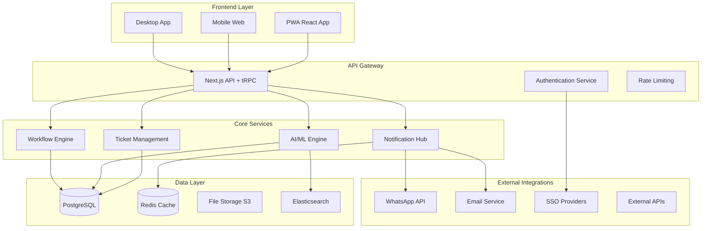
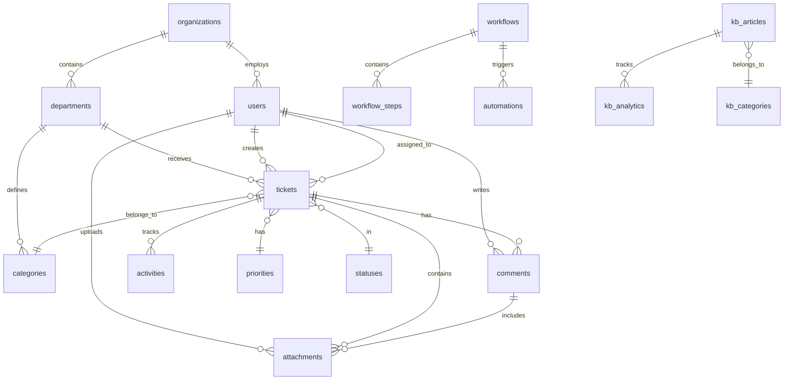

# ServiceDesk - Product Requirements Document (PRD) Completo

## 📋 **DOCUMENT CONTROL**

| Campo | Valor |
|-------|-------|
| **Versão** | 1.0 |
| **Data** | Setembro 2025 |
| **Status** | Draft → Review → Approved |
| **Responsável** | Product Owner |
| **Stakeholders** | Engineering, Design, QA, DevOps |
| **Próxima Revisão** | Quinzenal durante desenvolvimento |

---

## 🎯 **1. EXECUTIVE SUMMARY**

### **1.1 Visão do Produto**
O ServiceDesk é uma plataforma de gerenciamento de serviços corporativos de próxima geração que combina IA generativa, hiperautomação e design multi-persona para revolucionar o atendimento empresarial no mercado brasileiro e internacional.

### **1.2 Problema de Negócio**
- **Sistemas atuais são complexos**: 70% dos usuários relatam dificuldade de uso
- **Baixa eficiência**: Tempo médio de resolução 3-5 dias
- **Falta de inteligência**: 90% das categorizações são manuais
- **Mobile inadequado**: Apenas 20% dos sistemas têm mobile otimizado
- **Integrações limitadas**: Falta conectores para ecossistema brasileiro

### **1.3 Proposta de Valor**
- **80% redução** no tempo de resolução via IA
- **Interface intuitiva** que dispensa treinamento
- **PWA nativo** com experiência superior a apps
- **Integrações Brasil-first** (WhatsApp, gov.br, sistemas locais)
- **ROI positivo** em 3-6 meses

### **1.4 Objetivos de Negócio**
1. **Capturar 15%** do mercado SMB brasileiro em 24 meses
2. **ARR de $10M** até final de 2026
3. **NPS > 50** consistente
4. **Churn < 5%** anual
5. **Time-to-value < 2 semanas**

---

## 👥 **2. USER PERSONAS & USE CASES**

### **2.1 Persona Primária: End User (Sarah - Analista Financeiro)**

**Demografia:**
- 28 anos, Analista Financeiro
- Empresa 200+ funcionários
- Conhecimento técnico: Básico
- Dispositivos: 60% mobile, 40% desktop

**Goals:**
- Resolver problemas rapidamente sem complicação
- Acompanhar status das solicitações facilmente
- Encontrar respostas sem abrir ticket

**Pain Points:**
- Sistemas complexos com muitos campos
- Falta de feedback sobre andamento
- Dificuldade para encontrar informações

**User Stories:**
```gherkin
# Epic: Abertura de Tickets Simplificada
Feature: Como end user, quero abrir tickets de forma intuitiva

Scenario: Criação guiada de ticket
  Given eu acesso o portal de autoatendimento
  When eu descrevo meu problema em linguagem natural
  Then o sistema sugere categoria e prioridade automaticamente
  And apresenta artigos relacionados da knowledge base
  And permite abertura com mínimo de campos obrigatórios

Scenario: Acompanhamento visual
  Given eu tenho tickets abertos
  When acesso "Meus Tickets"
  Then vejo timeline visual com status atual
  And recebo estimativa de resolução baseada em IA
  And posso adicionar informações via chat integrado
```

### **2.2 Persona Secundária: Agent (Marcus - Analista de Suporte)**

**Demografia:**
- 32 anos, Analista de Suporte TI
- 5 anos experiência
- Conhecimento técnico: Avançado
- Dispositivos: 80% desktop, 20% mobile

**Goals:**
- Resolver máximo de tickets com qualidade
- Ter contexto completo do usuário
- Colaborar eficientemente com equipe

**Pain Points:**
- Informações fragmentadas em múltiplos sistemas
- Tickets mal categorizados
- Ferramentas lentas que interrompem fluxo

**User Stories:**
```gherkin
# Epic: Workspace Produtivo
Feature: Como agent, quero workspace otimizado para produtividade

Scenario: Contexto unificado do usuário
  Given eu abro um ticket
  When visualizo os detalhes
  Then vejo histórico completo do usuário
  And tickets relacionados automaticamente
  And sugestões de solução baseadas em casos similares
  And posso colaborar com outros agentes via chat interno

Scenario: Ações em lote
  Given eu tenho múltiplos tickets similares
  When seleciono múltiplos tickets
  Then posso atribuir, categorizar ou responder em lote
  And aplicar templates inteligentes
  And executar automações personalizadas
```

### **2.3 Persona Terciária: Manager (Ana - Gerente de TI)**

**Demografia:**
- 38 anos, Gerente de TI
- 10+ anos experiência
- Conhecimento técnico: Intermediário
- Foco: Métricas e performance

**Goals:**
- Visibilidade completa de performance da equipe
- Identificar gargalos e oportunidades
- Demonstrar ROI para C-level

**Pain Points:**
- Dados fragmentados para reports
- Falta de insights preditivos
- Dificuldade para exportar dados

**User Stories:**
```gherkin
# Epic: Analytics Executivo
Feature: Como manager, quero insights acionáveis

Scenario: Dashboard em tempo real
  Given eu acesso o dashboard gerencial
  When visualizo as métricas
  Then vejo KPIs atualizados em tempo real
  And alertas para anomalias ou tendências
  And posso fazer drill-down em qualquer métrica
  And exportar relatórios customizados

Scenario: Predições e recomendações
  Given o sistema analisa padrões históricos
  When identifica tendências
  Then recebo alertas preditivos (ex: pico de demanda)
  And sugestões de otimização de recursos
  And recomendações de treinamento para equipe
```

---

## ⚙️ **3. FUNCTIONAL REQUIREMENTS**

### **3.1 Módulo: Gerenciamento de Tickets**

#### **3.1.1 Criação de Tickets**

**RF-001: Criação Inteligente**
- Sistema DEVE permitir criação via múltiplos canais (web, email, WhatsApp, API)
- Sistema DEVE implementar IA para auto-categorização com 95%+ precisão
- Sistema DEVE sugerir prioridade baseada em contexto e histórico
- Sistema DEVE detectar tickets duplicados automaticamente
- Sistema DEVE aplicar templates dinâmicos baseados em categoria

**Critérios de Aceitação:**
```gherkin
Given usuário descreve problema: "Meu computador não liga"
When submete o ticket
Then sistema categoriza como "Hardware > Desktop"
And define prioridade "Alta" (equipamento crítico)
And sugere artigos KB relevantes
And aplica template com campos específicos de hardware
And accuracy de categorização > 95% em testes
```

**RF-002: Formulários Dinâmicos**
- Formulários DEVEM adaptar-se baseado na categoria selecionada
- Campos obrigatórios DEVEM ser configuráveis por departamento
- Sistema DEVE implementar validação em tempo real
- Anexos DEVEM suportar drag-and-drop com preview
- Auto-save DEVE ocorrer a cada 30 segundos

#### **3.1.2 Workflow e Status**

**RF-003: Estados Configuráveis**
- Sistema DEVE permitir configuração de status por departamento
- Transições DEVEM ser configuráveis com regras de negócio
- Workflow DEVE suportar aprovações paralelas e sequenciais
- Sistema DEVE implementar SLA tracking automático
- Escalação DEVE ser automática baseada em regras configuráveis

**Estados Padrão:**
```typescript
enum TicketStatus {
  DRAFT = 'draft',
  OPEN = 'open', 
  IN_PROGRESS = 'in_progress',
  PENDING_APPROVAL = 'pending_approval',
  PENDING_USER = 'pending_user',
  PENDING_VENDOR = 'pending_vendor',
  RESOLVED = 'resolved',
  CLOSED = 'closed',
  CANCELLED = 'cancelled'
}
```

**RF-004: Atribuição Inteligente**
- Sistema DEVE implementar round-robin balanceado
- Atribuição DEVE considerar expertise e carga de trabalho
- Sistema DEVE permitir atribuição automática por regras
- Reatribuição DEVE ser possível com histórico mantido
- Sistema DEVE suportar atribuição para times

#### **3.1.3 Comunicação e Colaboração**

**RF-005: Sistema de Comentários**
- Comentários DEVEM suportar rich text (markdown)
- Sistema DEVE implementar @mentions com notificações
- Comentários DEVEM ser públicos ou privados
- Sistema DEVE manter histórico completo de edições
- Anexos DEVEM ser suportados por comentário

**RF-006: Chat Integrado**
- Sistema DEVE implementar chat em tempo real via WebSocket
- Chat DEVE funcionar dentro do contexto do ticket
- Sistema DEVE mostrar indicadores de typing e presence
- Histórico do chat DEVE ser persistido
- Sistema DEVE suportar file sharing no chat

### **3.2 Módulo: Inteligência Artificial**

#### **3.2.1 Processamento de Linguagem Natural**

**RF-007: Análise de Texto**
- Sistema DEVE implementar NLP para extração de entidades
- Sistema DEVE identificar sentiment (positivo/negativo/neutro)
- Sistema DEVE detectar urgência através da linguagem
- Sistema DEVE extrair informações estruturadas de texto livre
- Sistema DEVE suportar português brasileiro nativo

**RF-008: Sugestões Inteligentes**
- Sistema DEVE sugerir respostas baseadas em histórico
- Sistema DEVE recomendar artigos KB relevantes
- Sistema DEVE identificar tickets similares automaticamente
- Sistema DEVE sugerir próximos passos para resolução
- Sugestões DEVEM ter confidence score

#### **3.2.2 Automação e Machine Learning**

**RF-009: Aprendizado Contínuo**
- Sistema DEVE implementar feedback loop para melhorar IA
- Modelo DEVE ser retreinado automaticamente
- Sistema DEVE manter métricas de accuracy da IA
- Sistema DEVE permitir ajustes manuais dos modelos
- Dados de treino DEVEM ser anonimizados

**RF-010: Predições**
- Sistema DEVE prever SLA violations com 2h+ antecedência
- Sistema DEVE estimar tempo de resolução
- Sistema DEVE identificar padrões e anomalias
- Sistema DEVE prever picos de demanda
- Sistema DEVE recomendar realocação de recursos

### **3.3 Módulo: Knowledge Base**

#### **3.3.1 Gestão de Conteúdo**

**RF-011: Editor Avançado**
- Sistema DEVE implementar editor WYSIWYG completo
- Sistema DEVE suportar embed de imagens, vídeos, e documentos
- Sistema DEVE permitir templates reutilizáveis
- Sistema DEVE implementar versionamento com diff visual
- Sistema DEVE suportar collaborative editing

**RF-012: Organização e Categorização**
- Sistema DEVE implementar taxonomia hierárquica
- Sistema DEVE suportar tags múltiplas por artigo
- Sistema DEVE permitir cross-reference entre artigos
- Sistema DEVE implementar workflows de aprovação
- Sistema DEVE controlar acesso por grupo/departamento

#### **3.3.2 Busca e Descoberta**

**RF-013: Busca Semântica**
- Sistema DEVE implementar busca por similaridade (embeddings)
- Sistema DEVE suportar auto-complete inteligente
- Sistema DEVE implementar faceted search
- Sistema DEVE rankear resultados por relevância e popularidade
- Sistema DEVE sugerir termos alternativos

**RF-014: Analytics de Conteúdo**
- Sistema DEVE rastrear views, shares, e ratings por artigo
- Sistema DEVE identificar gaps de conteúdo
- Sistema DEVE recomendar atualizações baseadas em tickets
- Sistema DEVE gerar relatórios de performance do KB
- Sistema DEVE implementar A/B testing de conteúdo

### **3.4 Módulo: Dashboards e Analytics**

#### **3.4.1 Métricas em Tempo Real**

**RF-015: KPIs Principais**
- Sistema DEVE calcular métricas padrão (MTTR, FCR, CSAT)
- Sistema DEVE implementar métricas customizáveis
- Updates DEVEM ser em tempo real via WebSocket
- Sistema DEVE suportar drill-down em todas as métricas
- Dados DEVEM ser atualizados com latência < 30 segundos

**Métricas Obrigatórias:**
```typescript
interface KPIs {
  // Volume
  total_tickets: number;
  new_tickets_today: number;
  tickets_by_status: Record<TicketStatus, number>;
  
  // Performance
  mean_time_to_resolution: number; // MTTR
  first_contact_resolution_rate: number; // FCR
  sla_compliance_rate: number;
  
  // Satisfaction
  customer_satisfaction_score: number; // CSAT
  net_promoter_score: number; // NPS
  
  // Productivity
  tickets_per_agent: number;
  resolution_rate: number;
  backlog_trend: number[];
}
```

**RF-016: Visualizações Interativas**
- Sistema DEVE implementar charts interativos (D3.js/Chart.js)
- Sistema DEVE suportar export para PDF/Excel
- Dashboards DEVEM ser responsivos e mobile-friendly
- Sistema DEVE permitir customização de layout
- Sistema DEVE implementar drill-down contextual

#### **3.4.2 Relatórios e Business Intelligence**

**RF-017: Report Builder**
- Sistema DEVE implementar construtor visual de relatórios
- Sistema DEVE suportar agendamento automático
- Sistema DEVE permitir filtros avançados
- Sistema DEVE implementar comparações temporais
- Relatórios DEVEM suportar múltiplos formatos de export

**RF-018: Insights Preditivos**
- Sistema DEVE implementar trend analysis automática
- Sistema DEVE identificar correlações automáticas
- Sistema DEVE gerar alertas para anomalias
- Sistema DEVE fornecer recomendações acionáveis
- Sistema DEVE implementar forecasting de demanda

### **3.5 Módulo: Integrações**

#### **3.5.1 Comunicação Externa**

**RF-019: WhatsApp Business Integration**
- Sistema DEVE integrar com WhatsApp Business API oficial
- Sistema DEVE permitir abertura de tickets via WhatsApp
- Sistema DEVE enviar updates de status automaticamente
- Sistema DEVE suportar media sharing (imagens, documentos)
- Sistema DEVE implementar chatbot para triagem inicial

**RF-020: Email Integration**
- Sistema DEVE processar emails incoming para criar tickets
- Sistema DEVE enviar notificações via templates personalizáveis
- Sistema DEVE implementar email parsing inteligente
- Sistema DEVE suportar múltiplas caixas de entrada
- Sistema DEVE manter threading de conversas

#### **3.5.2 Sistemas Corporativos**

**RF-021: SSO e Autenticação**
- Sistema DEVE suportar SAML 2.0 e OAuth 2.0
- Sistema DEVE integrar com Active Directory/LDAP
- Sistema DEVE suportar login gov.br
- Sistema DEVE implementar MFA configurável
- Sistema DEVE manter sessões sincronizadas

**RF-022: API Ecosystem**
- Sistema DEVE implementar REST API completa (OpenAPI 3.0)
- Sistema DEVE implementar GraphQL para queries complexas
- Sistema DEVE suportar webhooks bidirecionais
- Sistema DEVE implementar rate limiting configurável
- Sistema DEVE manter versionamento de API

---

## 🏗️ **4. NON-FUNCTIONAL REQUIREMENTS**

### **4.1 Performance**

**NFR-001: Response Time**
- Interface web DEVE carregar em < 2 segundos (P95)
- APIs DEVEM responder em < 500ms (P95)
- Busca DEVE retornar resultados em < 1 segundo
- Real-time updates DEVEM ter latência < 100ms
- Mobile app DEVE abrir em < 3 segundos

**NFR-002: Throughput**
- Sistema DEVE suportar 10,000 tickets criados/dia
- APIs DEVEM suportar 1,000 requests/minuto por cliente
- Sistema DEVE suportar 500 usuários simultâneos
- Busca DEVE suportar 100 queries/segundo
- Chat DEVE suportar 1,000 mensagens/minuto

**NFR-003: Scalability**
- Sistema DEVE escalar horizontalmente
- Database DEVE suportar partitioning
- Sistema DEVE suportar load balancing
- Cache DEVE ser distribuído (Redis Cluster)
- Sistema DEVE suportar auto-scaling

### **4.2 Reliability**

**NFR-004: Availability**
- Sistema DEVE manter 99.9% uptime (8.76h downtime/ano)
- Sistema DEVE implementar graceful degradation
- Sistema DEVE ter failover automático
- Backup DEVE ser automático e testado
- Recovery time DEVE ser < 1 hora

**NFR-005: Data Integrity**
- Sistema DEVE implementar ACID transactions
- Sistema DEVE ter backups incrementais diários
- Sistema DEVE implementar audit trail completo
- Sistema DEVE detectar e corrigir inconsistências
- Sistema DEVE implementar point-in-time recovery

### **4.3 Security**

**NFR-006: Authentication & Authorization**
- Sistema DEVE implementar RBAC granular
- Senhas DEVEM seguir políticas configuráveis
- Sistema DEVE implementar session timeout
- Sistema DEVE detectar logins suspeitos
- Sistema DEVE implementar account lockout

**NFR-007: Data Protection**
- Dados DEVEM ser criptografados at-rest (AES-256)
- Comunicação DEVE usar TLS 1.3
- Sistema DEVE implementar data masking para PII
- Sistema DEVE suportar data retention policies
- Sistema DEVE ser compliant com LGPD

### **4.4 Usability**

**NFR-008: User Experience**
- Interface DEVE seguir accessibility guidelines (WCAG 2.1 AA)
- Sistema DEVE suportar internacionalização (i18n)
- Interface DEVE ser responsiva (mobile-first)
- Sistema DEVE implementar progressive enhancement
- Help context DEVE estar disponível em todas as telas

**NFR-009: Mobile Experience**
- App DEVE funcionar offline (PWA)
- Interface DEVE suportar touch gestures
- App DEVE ser instalável via browser
- Push notifications DEVEM funcionar
- Interface DEVE adaptar para one-handed use

---

## 🎨 **5. UI/UX SPECIFICATIONS**

### **5.1 Design System**

#### **5.1.1 Visual Identity**

**Color Palette:**
```css
/* Primary Colors */
--primary-50: #eff6ff;
--primary-500: #3b82f6;  /* Main brand */
--primary-900: #1e3a8a;

/* Semantic Colors */
--success: #10b981;
--warning: #f59e0b;
--error: #ef4444;
--info: #06b6d4;

/* Neutral Scale */
--gray-50: #f9fafb;
--gray-500: #6b7280;
--gray-900: #111827;
```

**Typography:**
```css
/* Font Stack */
font-family: 'Inter', -apple-system, BlinkMacSystemFont, 'Segoe UI', sans-serif;

/* Scale */
--text-xs: 0.75rem;    /* 12px */
--text-sm: 0.875rem;   /* 14px */
--text-base: 1rem;     /* 16px */
--text-lg: 1.125rem;   /* 18px */
--text-xl: 1.25rem;    /* 20px */
```

**Spacing System:**
```css
/* 4px base unit */
--space-1: 0.25rem;  /* 4px */
--space-2: 0.5rem;   /* 8px */
--space-4: 1rem;     /* 16px */
--space-6: 1.5rem;   /* 24px */
--space-8: 2rem;     /* 32px */
```

#### **5.1.2 Component Library**

**Button Specifications:**
```typescript
interface ButtonProps {
  variant: 'primary' | 'secondary' | 'ghost' | 'danger';
  size: 'sm' | 'md' | 'lg';
  loading?: boolean;
  disabled?: boolean;
  icon?: IconComponent;
  children: ReactNode;
}

// Usage Examples
<Button variant="primary" size="md">Create Ticket</Button>
<Button variant="ghost" size="sm" icon={<EditIcon />}>Edit</Button>
```

**Input Specifications:**
```typescript
interface InputProps {
  type: 'text' | 'email' | 'password' | 'search';
  label: string;
  placeholder?: string;
  error?: string;
  helpText?: string;
  required?: boolean;
  disabled?: boolean;
}
```

### **5.2 Layout Specifications**

#### **5.2.1 Dashboard Layout**

**Grid System:**
- Container max-width: 1280px
- Gutter: 24px
- Columns: 12 (desktop), 8 (tablet), 4 (mobile)
- Breakpoints: sm(640px), md(768px), lg(1024px), xl(1280px)

**Header Specifications:**
```typescript
interface HeaderProps {
  height: '64px';
  background: 'white' | 'gray-50';
  shadow: 'sm';
  sticky: true;
  elements: {
    logo: LogoComponent;
    navigation: NavigationComponent;
    search: GlobalSearchComponent;
    notifications: NotificationCenterComponent;
    profile: UserMenuComponent;
  };
}
```

**Sidebar Specifications:**
```typescript
interface SidebarProps {
  width: '256px' | '64px'; // expanded | collapsed
  collapsible: true;
  position: 'fixed';
  navigation: NavigationItem[];
  footer: SidebarFooterComponent;
}

interface NavigationItem {
  label: string;
  icon: IconComponent;
  href: string;
  badge?: number; // notification count
  children?: NavigationItem[];
}
```

#### **5.2.2 Responsive Behavior**

**Breakpoint Behavior:**
```css
/* Mobile (< 768px) */
.mobile {
  sidebar: 'hidden'; /* drawer overlay */
  navigation: 'bottom-tabs';
  cards: 'single-column';
  tables: 'stacked-cards';
}

/* Tablet (768px - 1024px) */
.tablet {
  sidebar: 'collapsed';
  cards: 'two-columns';
  tables: 'horizontal-scroll';
}

/* Desktop (> 1024px) */
.desktop {
  sidebar: 'expanded';
  cards: 'three-columns';
  tables: 'full-width';
}
```

### **5.3 Interaction Patterns**

#### **5.3.1 Navigation Patterns**

**Breadcrumbs:**
```typescript
interface BreadcrumbProps {
  items: Array<{
    label: string;
    href?: string;
    current?: boolean;
  }>;
}

// Example: Home > Tickets > #12345 > Edit
```

**Command Palette (⌘K):**
```typescript
interface CommandPaletteProps {
  trigger: 'cmd+k' | 'ctrl+k';
  placeholder: 'Search tickets, users, articles...';
  categories: {
    'Quick Actions': ActionItem[];
    'Recent Tickets': TicketItem[];
    'Articles': ArticleItem[];
    'Users': UserItem[];
  };
}
```

#### **5.3.2 Form Patterns**

**Progressive Disclosure:**
```typescript
// Forms should reveal fields progressively
interface TicketFormProps {
  step1: 'basic-info'; // Title, description
  step2: 'categorization'; // Auto-suggested based on step1
  step3: 'additional-details'; // Category-specific fields
  step4: 'attachments'; // Optional files
  step5: 'review'; // Confirmation before submit
}
```

**Inline Validation:**
```typescript
interface ValidationRules {
  validateOnChange: true;
  showErrorsInstantly: true;
  showSuccessIndicators: true;
  preserveValidationOnResubmit: true;
}
```

#### **5.3.3 Feedback Patterns**

**Loading States:**
```typescript
interface LoadingStates {
  skeleton: 'use-for-initial-load';
  spinner: 'use-for-user-actions';
  progressBar: 'use-for-long-operations';
  pullToRefresh: 'use-for-mobile-lists';
}
```

**Toast Notifications:**
```typescript
interface ToastProps {
  type: 'success' | 'error' | 'warning' | 'info';
  duration: number; // auto-dismiss time
  action?: {
    label: string;
    onClick: () => void;
  };
  position: 'top-right'; // consistent position
}
```

---

## 🔧 **6. TECHNICAL ARCHITECTURE**

### **6.1 System Architecture**

#### **6.1.1 High-Level Architecture**



#### **6.1.2 Database Schema**

**Core Tables:**
```sql
-- Users and Authentication
CREATE TABLE users (
    id UUID PRIMARY KEY DEFAULT gen_random_uuid(),
    email VARCHAR(255) UNIQUE NOT NULL,
    password_hash VARCHAR(255),
    first_name VARCHAR(100) NOT NULL,
    last_name VARCHAR(100) NOT NULL,
    avatar_url TEXT,
    timezone VARCHAR(50) DEFAULT 'America/Sao_Paulo',
    language VARCHAR(10) DEFAULT 'pt-BR',
    is_active BOOLEAN DEFAULT true,
    last_login_at TIMESTAMP,
    created_at TIMESTAMP DEFAULT CURRENT_TIMESTAMP,
    updated_at TIMESTAMP DEFAULT CURRENT_TIMESTAMP
);

-- Organizations and Departments
CREATE TABLE organizations (
    id UUID PRIMARY KEY DEFAULT gen_random_uuid(),
    name VARCHAR(200) NOT NULL,
    slug VARCHAR(100) UNIQUE NOT NULL,
    domain VARCHAR(100),
    logo_url TEXT,
    settings JSONB DEFAULT '{}',
    plan VARCHAR(50) DEFAULT 'starter',
    is_active BOOLEAN DEFAULT true,
    created_at TIMESTAMP DEFAULT CURRENT_TIMESTAMP
);

CREATE TABLE departments (
    id UUID PRIMARY KEY DEFAULT gen_random_uuid(),
    organization_id UUID NOT NULL REFERENCES organizations(id),
    name VARCHAR(100) NOT NULL,
    description TEXT,
    parent_id UUID REFERENCES departments(id),
    manager_id UUID REFERENCES users(id),
    settings JSONB DEFAULT '{}',
    created_at TIMESTAMP DEFAULT CURRENT_TIMESTAMP
);

-- Tickets Core
CREATE TABLE tickets (
    id UUID PRIMARY KEY DEFAULT gen_random_uuid(),
    number VARCHAR(20) UNIQUE NOT NULL, -- T-2024-001234
    title VARCHAR(500) NOT NULL,
    description TEXT NOT NULL,
    
    -- Classification
    category_id UUID REFERENCES categories(id),
    priority_id UUID REFERENCES priorities(id),
    status_id UUID REFERENCES statuses(id),
    
    -- People
    requester_id UUID NOT NULL REFERENCES users(id),
    assignee_id UUID REFERENCES users(id),
    department_id UUID NOT NULL REFERENCES departments(id),
    
    -- AI Fields
    ai_category_confidence DECIMAL(3,2),
    ai_priority_prediction VARCHAR(50),
    ai_sentiment VARCHAR(20), -- positive, negative, neutral
    ai_urgency_score INTEGER CHECK (ai_urgency_score >= 0 AND ai_urgency_score <= 100),
    
    -- SLA Tracking
    sla_policy_id UUID REFERENCES sla_policies(id),
    due_at TIMESTAMP,
    first_response_at TIMESTAMP,
    resolved_at TIMESTAMP,
    closed_at TIMESTAMP,
    
    -- Metrics
    time_to_first_response INTERVAL,
    time_to_resolution INTERVAL,
    satisfaction_rating INTEGER CHECK (satisfaction_rating >= 1 AND satisfaction_rating <= 5),
    
    -- Metadata
    source VARCHAR(50) DEFAULT 'web', -- web, email, whatsapp, api
    custom_fields JSONB DEFAULT '{}',
    tags TEXT[],
    
    created_at TIMESTAMP DEFAULT CURRENT_TIMESTAMP,
    updated_at TIMESTAMP DEFAULT CURRENT_TIMESTAMP,
    
    -- Indexes for performance
    INDEX idx_tickets_status_assignee (status_id, assignee_id),
    INDEX idx_tickets_created_at (created_at DESC),
    INDEX idx_tickets_department (department_id),
    INDEX idx_tickets_requester (requester_id),
    INDEX idx_tickets_full_text (to_tsvector('portuguese', title || ' ' || description))
);

-- Activities (audit trail)
CREATE TABLE ticket_activities (
    id UUID PRIMARY KEY DEFAULT gen_random_uuid(),
    ticket_id UUID NOT NULL REFERENCES tickets(id) ON DELETE CASCADE,
    user_id UUID REFERENCES users(id),
    action VARCHAR(50) NOT NULL, -- created, updated, commented, assigned, etc.
    field_name VARCHAR(100), -- for field changes
    old_value JSONB,
    new_value JSONB,
    description TEXT,
    metadata JSONB DEFAULT '{}',
    created_at TIMESTAMP DEFAULT CURRENT_TIMESTAMP,
    
    INDEX idx_activities_ticket (ticket_id, created_at DESC),
    INDEX idx_activities_user (user_id, created_at DESC)
);

-- Comments
CREATE TABLE comments (
    id UUID PRIMARY KEY DEFAULT gen_random_uuid(),
    ticket_id UUID NOT NULL REFERENCES tickets(id) ON DELETE CASCADE,
    user_id UUID NOT NULL REFERENCES users(id),
    content TEXT NOT NULL,
    content_type VARCHAR(20) DEFAULT 'markdown', -- markdown, html, text
    is_internal BOOLEAN DEFAULT false,
    reply_to_id UUID REFERENCES comments(id),
    attachments JSONB DEFAULT '[]',
    reactions JSONB DEFAULT '{}', -- {👍: [user_ids], 👎: [user_ids]}
    edited_at TIMESTAMP,
    created_at TIMESTAMP DEFAULT CURRENT_TIMESTAMP,
    
    INDEX idx_comments_ticket (ticket_id, created_at),
    INDEX idx_comments_user (user_id)
);

-- File Attachments
CREATE TABLE attachments (
    id UUID PRIMARY KEY DEFAULT gen_random_uuid(),
    ticket_id UUID REFERENCES tickets(id) ON DELETE CASCADE,
    comment_id UUID REFERENCES comments(id) ON DELETE CASCADE,
    filename VARCHAR(255) NOT NULL,
    original_filename VARCHAR(255) NOT NULL,
    file_size BIGINT NOT NULL,
    mime_type VARCHAR(100) NOT NULL,
    file_path TEXT NOT NULL, -- S3 path
    thumbnail_path TEXT, -- for images
    uploaded_by UUID NOT NULL REFERENCES users(id),
    is_scanned BOOLEAN DEFAULT false, -- virus scan
    scan_result VARCHAR(50), -- clean, infected, unknown
    created_at TIMESTAMP DEFAULT CURRENT_TIMESTAMP,
    
    CONSTRAINT chk_attachment_belongs_to_ticket_or_comment 
        CHECK ((ticket_id IS NOT NULL) OR (comment_id IS NOT NULL))
);
```

**Configuration Tables:**
```sql
-- Categories (hierarchical)
CREATE TABLE categories (
    id UUID PRIMARY KEY DEFAULT gen_random_uuid(),
    name VARCHAR(100) NOT NULL,
    description TEXT,
    parent_id UUID REFERENCES categories(id),
    department_id UUID REFERENCES departments(id),
    icon VARCHAR(50), -- icon name
    color VARCHAR(7), -- hex color
    is_active BOOLEAN DEFAULT true,
    sort_order INTEGER DEFAULT 0,
    
    -- AI Training
    keywords TEXT[], -- for ML training
    auto_assign_to UUID REFERENCES users(id),
    default_priority_id UUID REFERENCES priorities(id),
    
    created_at TIMESTAMP DEFAULT CURRENT_TIMESTAMP
);

-- Priorities
CREATE TABLE priorities (
    id UUID PRIMARY KEY DEFAULT gen_random_uuid(),
    name VARCHAR(50) NOT NULL,
    level INTEGER UNIQUE NOT NULL, -- 1=lowest, 5=highest
    color VARCHAR(7) NOT NULL,
    icon VARCHAR(50),
    sla_hours INTEGER, -- default SLA for this priority
    auto_escalate_hours INTEGER,
    is_active BOOLEAN DEFAULT true,
    created_at TIMESTAMP DEFAULT CURRENT_TIMESTAMP
);

-- Statuses
CREATE TABLE statuses (
    id UUID PRIMARY KEY DEFAULT gen_random_uuid(),
    name VARCHAR(50) NOT NULL,
    status_type VARCHAR(20) NOT NULL, -- open, in_progress, resolved, closed
    color VARCHAR(7) NOT NULL,
    icon VARCHAR(50),
    is_final BOOLEAN DEFAULT false, -- terminal status
    is_active BOOLEAN DEFAULT true,
    sort_order INTEGER DEFAULT 0,
    created_at TIMESTAMP DEFAULT CURRENT_TIMESTAMP
);
```

**AI and Analytics Tables:**
```sql
-- AI Classifications (training data)
CREATE TABLE ai_classifications (
    id UUID PRIMARY KEY DEFAULT gen_random_uuid(),
    ticket_id UUID NOT NULL REFERENCES tickets(id),
    predicted_category_id UUID REFERENCES categories(id),
    actual_category_id UUID REFERENCES categories(id),
    confidence_score DECIMAL(3,2),
    model_version VARCHAR(50),
    is_correct BOOLEAN, -- feedback for training
    created_at TIMESTAMP DEFAULT CURRENT_TIMESTAMP,
    
    INDEX idx_ai_classifications_accuracy (is_correct, created_at)
);

-- Knowledge Base Analytics
CREATE TABLE kb_analytics (
    id UUID PRIMARY KEY DEFAULT gen_random_uuid(),
    article_id UUID NOT NULL,
    user_id UUID REFERENCES users(id),
    action VARCHAR(50) NOT NULL, -- view, like, dislike, share
    search_query TEXT, -- if found via search
    ticket_id UUID REFERENCES tickets(id), -- if suggested for ticket
    metadata JSONB DEFAULT '{}',
    created_at TIMESTAMP DEFAULT CURRENT_TIMESTAMP,
    
    INDEX idx_kb_analytics_article (article_id, created_at),
    INDEX idx_kb_analytics_search (search_query)
);

-- Real-time Metrics Cache
CREATE TABLE metrics_realtime (
    id UUID PRIMARY KEY DEFAULT gen_random_uuid(),
    metric_name VARCHAR(100) NOT NULL,
    department_id UUID REFERENCES departments(id),
    user_id UUID REFERENCES users(id),
    value DECIMAL(15,4) NOT NULL,
    timestamp TIMESTAMP NOT NULL,
    metadata JSONB DEFAULT '{}',
    
    INDEX idx_metrics_realtime_lookup (metric_name, department_id, timestamp DESC),
    
    -- Partition by month for performance
    PARTITION BY RANGE (timestamp)
);
```

#### **6.1.3 API Specifications**

**REST API Endpoints:**
```typescript
// Tickets API
interface TicketAPI {
  // CRUD Operations
  'GET /api/tickets': {
    query: {
      page?: number;
      limit?: number;
      status?: string[];
      assignee?: string;
      department?: string;
      priority?: string[];
      created_after?: string;
      created_before?: string;
      search?: string;
    };
    response: PaginatedResponse<Ticket>;
  };
  
  'POST /api/tickets': {
    body: CreateTicketRequest;
    response: Ticket;
  };
  
  'GET /api/tickets/:id': {
    params: { id: string };
    response: TicketDetail;
  };
  
  'PUT /api/tickets/:id': {
    params: { id: string };
    body: UpdateTicketRequest;
    response: Ticket;
  };
  
  // Actions
  'POST /api/tickets/:id/assign': {
    params: { id: string };
    body: { assignee_id: string; note?: string };
    response: { success: boolean };
  };
  
  'POST /api/tickets/:id/comments': {
    params: { id: string };
    body: CreateCommentRequest;
    response: Comment;
  };
  
  // AI Features
  'POST /api/tickets/:id/ai-suggest': {
    params: { id: string };
    response: {
      suggested_category: Category;
      suggested_priority: Priority;
      similar_tickets: Ticket[];
      recommended_articles: Article[];
      confidence_scores: Record<string, number>;
    };
  };
  
  // Bulk Operations
  'POST /api/tickets/bulk': {
    body: {
      ticket_ids: string[];
      action: 'assign' | 'update_status' | 'add_tags' | 'delete';
      payload: Record<string, any>;
    };
    response: { success: boolean; updated_count: number };
  };
}

// Real-time WebSocket Events
interface WebSocketEvents {
  // Inbound (client to server)
  'ticket:subscribe': { ticket_id: string };
  'ticket:unsubscribe': { ticket_id: string };
  'typing:start': { ticket_id: string };
  'typing:stop': { ticket_id: string };
  
  // Outbound (server to client)
  'ticket:updated': { ticket: Ticket; changes: FieldChange[] };
  'comment:created': { comment: Comment };
  'user:typing': { user: User; ticket_id: string };
  'notification:new': { notification: Notification };
}
```

**GraphQL Schema (for complex queries):**
```graphql
type Query {
  # Advanced ticket queries with joins
  tickets(
    filter: TicketFilter
    sort: TicketSort
    pagination: PaginationInput
  ): TicketConnection
  
  # Analytics queries
  metrics(
    timeRange: TimeRangeInput!
    groupBy: [MetricGroupBy!]
    filters: MetricFilter
  ): [MetricPoint!]!
  
  # Search with facets
  search(
    query: String!
    types: [SearchableType!]
    filters: SearchFilter
  ): SearchResult
}

type Mutation {
  # Ticket operations
  createTicket(input: CreateTicketInput!): TicketPayload
  updateTicket(id: ID!, input: UpdateTicketInput!): TicketPayload
  
  # Bulk operations
  bulkUpdateTickets(
    ids: [ID!]!
    input: BulkUpdateInput!
  ): BulkUpdatePayload
}

type Subscription {
  # Real-time updates
  ticketUpdated(id: ID!): Ticket
  newTicketCreated(departmentId: ID): Ticket
  notificationReceived(userId: ID!): Notification
}
```

### **6.2 AI/ML Architecture**

#### **6.2.1 Machine Learning Pipeline**

```python
# AI Service Architecture
class AIServicePipeline:
    def __init__(self):
        self.text_processor = TextProcessor()
        self.category_classifier = CategoryClassifier()
        self.priority_predictor = PriorityPredictor()
        self.similarity_engine = SimilarityEngine()
        self.sentiment_analyzer = SentimentAnalyzer()
    
    async def process_ticket(self, ticket: Ticket) -> AIAnalysis:
        # Step 1: Text preprocessing
        processed_text = self.text_processor.clean_and_tokenize(
            text=f"{ticket.title} {ticket.description}",
            language="pt-BR"
        )
        
        # Step 2: Feature extraction
        features = await self.extract_features(processed_text, ticket)
        
        # Step 3: Predictions
        category_prediction = await self.category_classifier.predict(features)
        priority_prediction = await self.priority_predictor.predict(features)
        sentiment = await self.sentiment_analyzer.analyze(processed_text)
        similar_tickets = await self.similarity_engine.find_similar(features)
        
        return AIAnalysis(
            category=category_prediction,
            priority=priority_prediction,
            sentiment=sentiment,
            similar_tickets=similar_tickets,
            confidence_scores={
                'category': category_prediction.confidence,
                'priority': priority_prediction.confidence
            }
        )
```

#### **6.2.2 Model Training Pipeline**

```python
# Training Pipeline
class ModelTrainingPipeline:
    def __init__(self):
        self.data_loader = TrainingDataLoader()
        self.feature_engineer = FeatureEngineer()
        self.model_trainer = ModelTrainer()
        self.model_evaluator = ModelEvaluator()
    
    async def train_models(self):
        # Load training data from database
        training_data = await self.data_loader.load_historical_tickets(
            limit=50000,
            min_confidence=0.8  # Only use high-confidence labels
        )
        
        # Feature engineering
        features = self.feature_engineer.transform(training_data)
        
        # Train models
        category_model = await self.model_trainer.train_classification(
            features=features,
            target='category',
            algorithm='transformer'  # BERT-based for Portuguese
        )
        
        priority_model = await self.model_trainer.train_regression(
            features=features,
            target='priority_score',
            algorithm='gradient_boosting'
        )
        
        # Evaluate and deploy if performance improves
        if await self.evaluate_models(category_model, priority_model):
            await self.deploy_models(category_model, priority_model)
    
    async def evaluate_models(self, category_model, priority_model) -> bool:
        test_data = await self.data_loader.load_test_data()
        
        category_accuracy = self.model_evaluator.accuracy(
            model=category_model,
            test_data=test_data
        )
        
        priority_mae = self.model_evaluator.mean_absolute_error(
            model=priority_model,
            test_data=test_data
        )
        
        # Deploy only if better than current production models
        return (
            category_accuracy > 0.95 and  # 95% accuracy threshold
            priority_mae < 0.3  # Low error threshold
        )
```

### **6.3 Security Architecture**

#### **6.3.1 Authentication Flow**

```typescript
// JWT Authentication Service
class AuthenticationService {
  async authenticate(credentials: LoginCredentials): Promise<AuthResult> {
    // Step 1: Validate credentials
    const user = await this.validateCredentials(credentials);
    if (!user) throw new UnauthorizedError('Invalid credentials');
    
    // Step 2: Generate tokens
    const accessToken = this.generateAccessToken(user, { expiresIn: '15m' });
    const refreshToken = this.generateRefreshToken(user, { expiresIn: '7d' });
    
    // Step 3: Store refresh token securely
    await this.storeRefreshToken(user.id, refreshToken);
    
    // Step 4: Log authentication
    await this.auditLog.record({
      action: 'login',
      userId: user.id,
      ip: credentials.ip,
      userAgent: credentials.userAgent
    });
    
    return {
      user: this.sanitizeUser(user),
      accessToken,
      refreshToken,
      expiresIn: 900 // 15 minutes
    };
  }
  
  async refreshTokens(refreshToken: string): Promise<AuthResult> {
    // Validate and rotate refresh token
    const payload = this.verifyRefreshToken(refreshToken);
    const user = await this.userService.findById(payload.userId);
    
    // Generate new tokens
    const newAccessToken = this.generateAccessToken(user);
    const newRefreshToken = this.generateRefreshToken(user);
    
    // Invalidate old refresh token
    await this.invalidateRefreshToken(refreshToken);
    await this.storeRefreshToken(user.id, newRefreshToken);
    
    return { user, accessToken: newAccessToken, refreshToken: newRefreshToken };
  }
}
```

#### **6.3.2 Authorization System**

```typescript
// Role-Based Access Control
interface Permission {
  resource: string; // 'tickets', 'users', 'analytics'
  action: string;   // 'create', 'read', 'update', 'delete'
  conditions?: {
    department?: string[];
    owner_only?: boolean;
    status?: string[];
  };
}

interface Role {
  id: string;
  name: string;
  permissions: Permission[];
  department_id?: string;
}

class AuthorizationService {
  async checkPermission(
    userId: string, 
    resource: string, 
    action: string, 
    context?: Record<string, any>
  ): Promise<boolean> {
    // Get user roles
    const userRoles = await this.getUserRoles(userId);
    
    // Check each role's permissions
    for (const role of userRoles) {
      const hasPermission = role.permissions.some(permission => {
        // Match resource and action
        if (permission.resource !== resource || permission.action !== action) {
          return false;
        }
        
        // Check conditions
        if (permission.conditions) {
          return this.evaluateConditions(permission.conditions, context);
        }
        
        return true;
      });
      
      if (hasPermission) return true;
    }
    
    return false;
  }
  
  private evaluateConditions(
    conditions: Permission['conditions'], 
    context: Record<string, any>
  ): boolean {
    if (conditions.department && context.departmentId) {
      return conditions.department.includes(context.departmentId);
    }
    
    if (conditions.owner_only && context.ownerId) {
      return context.ownerId === context.userId;
    }
    
    if (conditions.status && context.status) {
      return conditions.status.includes(context.status);
    }
    
    return true;
  }
}
```

---

## 🧪 **7. TESTING STRATEGY**

### **7.1 Testing Pyramid**

#### **7.1.1 Unit Tests (70% coverage target)**

```typescript
// Example: Ticket Service Unit Tests
describe('TicketService', () => {
  let ticketService: TicketService;
  let mockDatabase: jest.Mocked<Database>;
  let mockAIService: jest.Mocked<AIService>;
  
  beforeEach(() => {
    mockDatabase = createMockDatabase();
    mockAIService = createMockAIService();
    ticketService = new TicketService(mockDatabase, mockAIService);
  });
  
  describe('createTicket', () => {
    it('should create ticket with AI classification', async () => {
      // Arrange
      const ticketData = {
        title: 'Computador não liga',
        description: 'Tentei ligar várias vezes mas não funciona',
        requesterId: 'user-123',
        departmentId: 'dept-it'
      };
      
      mockAIService.classifyTicket.mockResolvedValue({
        category: 'hardware',
        priority: 'high',
        confidence: 0.95
      });
      
      mockDatabase.tickets.create.mockResolvedValue({
        id: 'ticket-123',
        number: 'T-2024-001',
        ...ticketData
      });
      
      // Act
      const result = await ticketService.createTicket(ticketData);
      
      // Assert
      expect(mockAIService.classifyTicket).toHaveBeenCalledWith(ticketData);
      expect(mockDatabase.tickets.create).toHaveBeenCalledWith({
        ...ticketData,
        category: 'hardware',
        priority: 'high',
        ai_confidence: 0.95
      });
      expect(result.number).toBe('T-2024-001');
    });
    
    it('should handle AI service failure gracefully', async () => {
      // Arrange
      mockAIService.classifyTicket.mockRejectedValue(new Error('AI service down'));
      
      // Act & Assert
      await expect(ticketService.createTicket(validTicketData))
        .not.toThrow(); // Should not fail even if AI fails
      
      expect(mockDatabase.tickets.create).toHaveBeenCalledWith(
        expect.objectContaining({
          category: 'unclassified', // fallback
          priority: 'medium' // default
        })
      );
    });
  });
  
  describe('getTicketById', () => {
    it('should return ticket with permissions check', async () => {
      // Test permission-based data filtering
    });
    
    it('should throw NotFoundError for non-existent ticket', async () => {
      // Test error handling
    });
  });
});
```

#### **7.1.2 Integration Tests (20% coverage target)**

```typescript
// Example: API Integration Tests
describe('Tickets API Integration', () => {
  let app: Application;
  let database: Database;
  let testUser: User;
  let authToken: string;
  
  beforeAll(async () => {
    // Setup test database
    database = await setupTestDatabase();
    app = createTestApp(database);
    
    // Create test user and get auth token
    testUser = await createTestUser();
    authToken = await getAuthToken(testUser);
  });
  
  afterAll(async () => {
    await cleanupTestDatabase(database);
  });
  
  describe('POST /api/tickets', () => {
    it('should create ticket and return 201', async () => {
      const ticketData = {
        title: 'Test ticket',
        description: 'Test description',
        department_id: testUser.department_id
      };
      
      const response = await request(app)
        .post('/api/tickets')
        .set('Authorization', `Bearer ${authToken}`)
        .send(ticketData)
        .expect(201);
      
      expect(response.body).toMatchObject({
        id: expect.any(String),
        number: expect.stringMatching(/^T-\d{4}-\d+$/),
        title: ticketData.title,
        status: 'open',
        requester_id: testUser.id
      });
      
      // Verify in database
      const savedTicket = await database.tickets.findById(response.body.id);
      expect(savedTicket).toBeTruthy();
    });
    
    it('should return 400 for invalid data', async () => {
      const invalidData = { title: '' }; // missing required fields
      
      await request(app)
        .post('/api/tickets')
        .set('Authorization', `Bearer ${authToken}`)
        .send(invalidData)
        .expect(400);
    });
    
    it('should return 401 for unauthenticated request', async () => {
      await request(app)
        .post('/api/tickets')
        .send(validTicketData)
        .expect(401);
    });
  });
  
  describe('GET /api/tickets', () => {
    beforeEach(async () => {
      // Seed test data
      await seedTickets(testUser);
    });
    
    it('should return paginated tickets with filters', async () => {
      const response = await request(app)
        .get('/api/tickets')
        .query({
          status: ['open', 'in_progress'],
          limit: 10,
          page: 1
        })
        .set('Authorization', `Bearer ${authToken}`)
        .expect(200);
      
      expect(response.body).toMatchObject({
        data: expect.any(Array),
        pagination: {
          page: 1,
          limit: 10,
          total: expect.any(Number),
          pages: expect.any(Number)
        }
      });
      
      // Verify all tickets have allowed status
      response.body.data.forEach(ticket => {
        expect(['open', 'in_progress']).toContain(ticket.status);
      });
    });
    
    it('should respect department permissions', async () => {
      // Test that users only see tickets from their department
    });
  });
});
```

#### **7.1.3 End-to-End Tests (10% coverage target)**

```typescript
// Example: E2E Tests with Playwright
import { test, expect, Page } from '@playwright/test';

test.describe('Ticket Management Flow', () => {
  let page: Page;
  
  test.beforeEach(async ({ browser }) => {
    page = await browser.newPage();
    
    // Login as test user
    await loginAsUser(page, {
      email: 'test@example.com',
      password: 'password123'
    });
  });
  
  test('should create ticket through UI', async () => {
    // Navigate to create ticket page
    await page.click('[data-testid="create-ticket-button"]');
    await expect(page).toHaveURL('/tickets/new');
    
    // Fill form
    await page.fill('[data-testid="ticket-title"]', 'E2E Test Ticket');
    await page.fill('[data-testid="ticket-description"]', 'This is a test ticket created via E2E test');
    
    // Select category (should be auto-suggested)
    await page.click('[data-testid="category-dropdown"]');
    await page.click('[data-testid="category-option-software"]');
    
    // Submit form
    await page.click('[data-testid="submit-ticket"]');
    
    // Wait for success message
    await expect(page.locator('[data-testid="success-toast"]')).toBeVisible();
    
    // Verify ticket was created
    await expect(page).toHaveURL(/\/tickets\/T-\d{4}-\d+/);
    await expect(page.locator('[data-testid="ticket-title"]')).toContainText('E2E Test Ticket');
  });
  
  test('should update ticket status through workflow', async () => {
    // Create a test ticket first
    const ticketId = await createTestTicket();
    
    // Navigate to ticket
    await page.goto(`/tickets/${ticketId}`);
    
    // Update status
    await page.click('[data-testid="status-dropdown"]');
    await page.click('[data-testid="status-in-progress"]');
    
    // Add comment
    await page.fill('[data-testid="comment-editor"]', 'Working on this issue');
    await page.click('[data-testid="add-comment"]');
    
    // Verify status update
    await expect(page.locator('[data-testid="ticket-status"]')).toContainText('In Progress');
    await expect(page.locator('[data-testid="comment-list"]')).toContainText('Working on this issue');
  });
  
  test('should handle real-time updates', async () => {
    // Open ticket in two tabs to test real-time sync
    const ticketId = await createTestTicket();
    
    // First tab
    await page.goto(`/tickets/${ticketId}`);
    
    // Second tab (simulate another user)
    const page2 = await browser.newPage();
    await loginAsUser(page2, { email: 'agent@example.com', password: 'password123' });
    await page2.goto(`/tickets/${ticketId}`);
    
    // Update ticket in second tab
    await page2.fill('[data-testid="comment-editor"]', 'Real-time test comment');
    await page2.click('[data-testid="add-comment"]');
    
    // Verify update appears in first tab
    await expect(page.locator('[data-testid="comment-list"]'))
      .toContainText('Real-time test comment', { timeout: 5000 });
  });
});

test.describe('Mobile Experience', () => {
  test.use({ 
    viewport: { width: 375, height: 667 }, // iPhone SE
    isMobile: true 
  });
  
  test('should work on mobile devices', async ({ page }) => {
    await loginAsUser(page, testUser);
    
    // Test mobile navigation
    await page.click('[data-testid="mobile-menu-button"]');
    await expect(page.locator('[data-testid="mobile-menu"]')).toBeVisible();
    
    // Test mobile ticket creation
    await page.click('[data-testid="create-ticket-fab"]'); // floating action button
    await expect(page).toHaveURL('/tickets/new');
    
    // Test responsive form
    await page.fill('[data-testid="ticket-title"]', 'Mobile ticket');
    await page.fill('[data-testid="ticket-description"]', 'Created on mobile');
    
    // Test mobile photo upload
    await page.setInputFiles('[data-testid="file-upload"]', 'test-image.jpg');
    await expect(page.locator('[data-testid="file-preview"]')).toBeVisible();
    
    await page.click('[data-testid="submit-ticket"]');
    await expect(page.locator('[data-testid="success-toast"]')).toBeVisible();
  });
});
```

### **7.2 Performance Testing**

#### **7.2.1 Load Testing with K6**

```javascript
// load-test.js
import http from 'k6/http';
import { check, sleep } from 'k6';
import { Rate } from 'k6/metrics';

export let errorRate = new Rate('errors');

export let options = {
  stages: [
    { duration: '2m', target: 100 }, // Ramp up to 100 users
    { duration: '5m', target: 100 }, // Stay at 100 users
    { duration: '2m', target: 200 }, // Ramp up to 200 users  
    { duration: '5m', target: 200 }, // Stay at 200 users
    { duration: '2m', target: 0 },   // Ramp down to 0 users
  ],
  thresholds: {
    http_req_duration: ['p(95)<2000'], // 95% of requests must complete below 2s
    http_req_failed: ['rate<0.1'],     // Error rate must be below 10%
    errors: ['rate<0.1'],              // Custom error rate
  },
};

const BASE_URL = 'https://api.servicedesk.example.com';

export function setup() {
  // Login and get auth token
  const response = http.post(`${BASE_URL}/auth/login`, {
    email: 'loadtest@example.com',
    password: 'password123'
  });
  
  return { token: response.json().accessToken };
}

export default function(data) {
  const headers = {
    'Authorization': `Bearer ${data.token}`,
    'Content-Type': 'application/json',
  };
  
  // Test ticket listing (most common operation)
  let response = http.get(`${BASE_URL}/api/tickets?limit=20`, { headers });
  check(response, {
    'tickets list status is 200': (r) => r.status === 200,
    'tickets list response time < 1s': (r) => r.timings.duration < 1000,
  }) || errorRate.add(1);
  
  sleep(1);
  
  // Test ticket creation (write operation)
  const ticketData = {
    title: `Load test ticket ${__ITER}`,
    description: 'This is a load test ticket',
    department_id: 'dept-123'
  };
  
  response = http.post(`${BASE_URL}/api/tickets`, JSON.stringify(ticketData), { headers });
  check(response, {
    'ticket creation status is 201': (r) => r.status === 201,
    'ticket creation response time < 2s': (r) => r.timings.duration < 2000,
  }) || errorRate.add(1);
  
  sleep(2);
  
  // Test search (complex operation)
  response = http.get(`${BASE_URL}/api/search?q=test&type=tickets`, { headers });
  check(response, {
    'search status is 200': (r) => r.status === 200,
    'search response time < 3s': (r) => r.timings.duration < 3000,
  }) || errorRate.add(1);
  
  sleep(1);
}

export function teardown(data) {
  // Cleanup test data if needed
}
```

#### **7.2.2 Database Performance Testing**

```sql
-- Performance test queries
-- These should complete within acceptable timeframes

-- Test ticket listing with filters (should be < 100ms)
EXPLAIN ANALYZE 
SELECT t.*, u.first_name, u.last_name, c.name as category_name
FROM tickets t
JOIN users u ON t.requester_id = u.id
JOIN categories c ON t.category_id = c.id
WHERE t.status_id IN ('open', 'in_progress')
  AND t.department_id = 'dept-123'
  AND t.created_at >= NOW() - INTERVAL '30 days'
ORDER BY t.created_at DESC
LIMIT 20;

-- Test complex analytics query (should be < 500ms)
EXPLAIN ANALYZE
SELECT 
  DATE_TRUNC('day', created_at) as date,
  COUNT(*) as total_tickets,
  AVG(EXTRACT(EPOCH FROM time_to_resolution)) as avg_resolution_time,
  COUNT(*) FILTER (WHERE satisfaction_rating >= 4) as satisfied_customers
FROM tickets
WHERE created_at >= NOW() - INTERVAL '90 days'
  AND status_id = 'closed'
GROUP BY DATE_TRUNC('day', created_at)
ORDER BY date;

-- Test full-text search (should be < 200ms)
EXPLAIN ANALYZE
SELECT *, ts_rank(to_tsvector('portuguese', title || ' ' || description), query) as rank
FROM tickets, to_tsquery('portuguese', 'computador & problema') query
WHERE to_tsvector('portuguese', title || ' ' || description) @@ query
ORDER BY rank DESC
LIMIT 10;
```

---

## 📊 **8. METRICS & KPIs**

### **8.1 Business Metrics**

#### **8.1.1 Customer Satisfaction**

```typescript
interface CustomerSatisfactionMetrics {
  // Primary KPIs
  csat_score: {
    current: number;        // 1-5 scale
    target: 4.5;
    trend: 'increasing' | 'decreasing' | 'stable';
    period: 'last_30_days';
  };
  
  nps_score: {
    current: number;        // -100 to +100
    target: 50;
    promoters: number;      // 9-10 ratings
    detractors: number;     // 0-6 ratings
    passives: number;       // 7-8 ratings
  };
  
  // Supporting Metrics
  first_contact_resolution: {
    rate: number;           // percentage
    target: 80;
    trend: number[];        // daily values for chart
  };
  
  response_time: {
    first_response: {
      average: number;      // minutes
      p95: number;
      target: 60;           // 1 hour SLA
    };
    resolution_time: {
      average: number;      // hours
      p95: number;
      target: 24;           // 24 hour SLA
    };
  };
}
```

#### **8.1.2 Operational Efficiency**

```typescript
interface OperationalMetrics {
  ticket_volume: {
    total_tickets: number;
    new_today: number;
    resolved_today: number;
    backlog: number;
    trend: {
      daily: number[];
      weekly: number[];
      monthly: number[];
    };
  };
  
  agent_productivity: {
    tickets_per_agent_per_day: {
      average: number;
      by_agent: Array<{ agent_id: string; count: number }>;
      target: 15;
    };
    
    utilization_rate: {
      average: number;      // percentage of working time on tickets
      target: 75;
    };
    
    quality_score: {
      average: number;      // based on CSAT and internal reviews
      target: 4.0;
    };
  };
  
  automation_impact: {
    deflection_rate: {
      current: number;      // % tickets resolved by automation
      target: 30;
      breakdown: {
        chatbot: number;
        kb_self_service: number;
        auto_resolution: number;
      };
    };
    
    time_savings: {
      hours_saved_per_month: number;
      cost_savings: number; // in currency
    };
  };
}
```

### **8.2 Technical Metrics**

#### **8.2.1 System Performance**

```typescript
interface PerformanceMetrics {
  response_times: {
    api_p95: number;        // milliseconds
    api_p99: number;
    page_load_p95: number;
    search_p95: number;
    targets: {
      api_p95: 500;
      page_load_p95: 2000;
      search_p95: 1000;
    };
  };
  
  availability: {
    uptime_percentage: number;  // 99.9% target
    mtbf: number;              // mean time between failures (hours)
    mttr: number;              // mean time to recovery (minutes)
    incidents_this_month: number;
  };
  
  scalability: {
    concurrent_users: {
      current: number;
      peak_today: number;
      capacity: number;
    };
    
    database_performance: {
      query_time_p95: number;   // milliseconds
      connection_pool_usage: number; // percentage
      slow_queries_count: number;
    };
    
    cache_performance: {
      hit_rate: number;         // percentage
      memory_usage: number;     // percentage
      eviction_rate: number;    // evictions per minute
    };
  };
}
```

#### **8.2.2 AI Model Performance**

```typescript
interface AIMetrics {
  classification_accuracy: {
    category_prediction: {
      accuracy: number;         // percentage
      precision: number;
      recall: number;
      f1_score: number;
      target_accuracy: 95;
    };
    
    priority_prediction: {
      accuracy: number;
      mae: number;              // mean absolute error
      target_accuracy: 90;
    };
    
    sentiment_analysis: {
      accuracy: number;
      confidence_threshold: 0.7;
      target_accuracy: 85;
    };
  };
  
  model_performance: {
    inference_time: {
      average: number;          // milliseconds
      p95: number;
      target: 200;
    };
    
    training_metrics: {
      last_training_date: string;
      training_duration: number; // minutes
      model_version: string;
      data_volume: number;      // number of training samples
    };
    
    drift_detection: {
      accuracy_drift: number;   // percentage change from baseline
      data_drift_score: number; // 0-1 scale
      alert_threshold: 0.05;    // 5% accuracy drop triggers retraining
    };
  };
  
  automation_success: {
    auto_resolution_rate: number;     // % tickets resolved without human
    false_positive_rate: number;      // % incorrectly auto-resolved
    user_satisfaction_with_ai: number; // CSAT for AI interactions
  };
}
```

### **8.3 User Adoption Metrics**

#### **8.3.1 Feature Usage**

```typescript
interface UserAdoptionMetrics {
  feature_adoption: {
    knowledge_base: {
      daily_active_users: number;
      searches_per_user: number;
      self_service_success_rate: number; // % searches that don't lead to tickets
    };
    
    mobile_app: {
      mobile_traffic_percentage: number;
      mobile_ticket_creation_rate: number;
      mobile_user_retention: number;     // % users who return within 7 days
    };
    
    collaboration_features: {
      comments_per_ticket: number;
      mentions_usage: number;            // @mentions per day
      file_sharing_usage: number;
      chat_adoption_rate: number;        // % tickets using chat
    };
    
    automation_usage: {
      workflow_adoption_by_department: Record<string, number>;
      template_usage_rate: number;
      bulk_actions_usage: number;
    };
  };
  
  user_engagement: {
    daily_active_users: number;
    monthly_active_users: number;
    session_duration: {
      average: number;                   // minutes
      by_user_type: Record<string, number>;
    };
    
    feature_discovery: {
      help_tooltip_usage: number;
      onboarding_completion_rate: number;
      advanced_feature_adoption: number; // % users using >5 features
    };
  };
}
```

### **8.4 Business Impact Metrics**

#### **8.4.1 ROI and Cost Savings**

```typescript
interface BusinessImpactMetrics {
  cost_savings: {
    labor_cost_reduction: {
      hours_saved_per_month: number;
      cost_per_hour: number;
      total_monthly_savings: number;
    };
    
    efficiency_gains: {
      tickets_resolved_per_hour_improvement: number;
      first_call_resolution_improvement: number;
      training_cost_reduction: number;   // due to intuitive interface
    };
  };
  
  revenue_impact: {
    customer_retention: {
      churn_rate_improvement: number;    // percentage points
      retention_revenue_impact: number;
    };
    
    employee_productivity: {
      reduced_downtime: number;          // hours per month
      faster_issue_resolution: number;   // hours saved
      productivity_value: number;        // monetary value
    };
  };
  
  roi_calculation: {
    implementation_cost: number;
    monthly_operational_cost: number;
    monthly_savings: number;
    monthly_revenue_impact: number;
    net_monthly_benefit: number;
    roi_percentage: number;             // (benefits - costs) / costs * 100
    payback_period_months: number;
  };
}
```

### **8.5 Metric Collection & Reporting**

#### **8.5.1 Real-time Dashboard Configuration**

```typescript
interface DashboardConfig {
  executive_dashboard: {
    refresh_interval: '30s';
    widgets: [
      {
        type: 'metric_card';
        title: 'Customer Satisfaction';
        metric: 'csat_score';
        target: 4.5;
        format: 'decimal_1';
      },
      {
        type: 'trend_chart';
        title: 'Ticket Volume Trend';
        metrics: ['new_tickets', 'resolved_tickets'];
        time_range: '30d';
      },
      {
        type: 'gauge';
        title: 'SLA Compliance';
        metric: 'sla_compliance_rate';
        target: 95;
        thresholds: { green: 95, yellow: 85, red: 0 };
      }
    ];
  };
  
  operational_dashboard: {
    refresh_interval: '10s';
    widgets: [
      {
        type: 'realtime_counter';
        title: 'Open Tickets';
        metric: 'open_tickets_count';
      },
      {
        type: 'agent_performance_table';
        title: 'Agent Performance Today';
        metrics: ['tickets_resolved', 'avg_resolution_time', 'csat'];
        sort_by: 'tickets_resolved';
      }
    ];
  };
}
```

#### **8.5.2 Automated Reporting**

```typescript
interface AutomatedReports {
  daily_ops_report: {
    schedule: '8:00 AM daily';
    recipients: ['ops_team@company.com'];
    content: {
      yesterday_summary: MetricsSummary;
      top_issues: Issue[];
      agent_highlights: AgentPerformance[];
      upcoming_sla_violations: Ticket[];
    };
  };
  
  weekly_executive_report: {
    schedule: 'Monday 9:00 AM';
    recipients: ['executives@company.com'];
    content: {
      week_over_week_comparison: MetricsComparison;
      key_insights: Insight[];
      action_items: ActionItem[];
      upcoming_challenges: Challenge[];
    };
  };
  
  monthly_business_review: {
    schedule: '1st of month 10:00 AM';
    format: 'PDF + PowerPoint';
    content: {
      executive_summary: ExecutiveSummary;
      detailed_analytics: DetailedAnalytics;
      roi_analysis: ROIAnalysis;
      recommendations: Recommendation[];
    };
  };
}
```

---

## 🚀 **9. DEPLOYMENT & ROLLOUT PLAN**

### **9.1 Deployment Strategy**

#### **9.1.1 Environment Setup**

```yaml
# Infrastructure as Code (Terraform)
environments:
  development:
    purpose: "Feature development and testing"
    infrastructure:
      compute: "2x t3.medium instances"
      database: "PostgreSQL 15 (t3.micro)"
      cache: "Redis 7 (t3.micro)"
      storage: "S3 bucket with versioning"
    deployment: "Automatic on PR merge to develop"
    
  staging:
    purpose: "Integration testing and UAT"
    infrastructure:
      compute: "2x t3.large instances (prod mirror)"
      database: "PostgreSQL 15 (t3.small)"
      cache: "Redis 7 (t3.small)"
      storage: "S3 bucket with prod data subset"
    deployment: "Manual approval required"
    data_refresh: "Weekly from production (anonymized)"
    
  production:
    purpose: "Live customer environment"
    infrastructure:
      compute: "3x t3.xlarge instances (auto-scaling)"
      database: "PostgreSQL 15 RDS (Multi-AZ)"
      cache: "Redis 7 Cluster (3 nodes)"
      storage: "S3 bucket with Cross-Region Replication"
    deployment: "Blue-green with manual approval"
    backup: "Automated daily snapshots"
    monitoring: "Full observability stack"
```

#### **9.1.2 CI/CD Pipeline**

```yaml
# GitHub Actions Workflow
name: ServiceDesk CI/CD
on:
  push:
    branches: [develop, staging, main]
  pull_request:
    branches: [develop]

jobs:
  test:
    runs-on: ubuntu-latest
    steps:
      - uses: actions/checkout@v4
      - uses: actions/setup-node@v4
        with:
          node-version: '18'
          cache: 'npm'
      
      - name: Install dependencies
        run: npm ci
      
      - name: Run linting
        run: npm run lint
      
      - name: Run unit tests
        run: npm run test:unit -- --coverage
      
      - name: Run integration tests
        run: npm run test:integration
        env:
          DATABASE_URL: ${{ secrets.TEST_DATABASE_URL }}
          REDIS_URL: ${{ secrets.TEST_REDIS_URL }}
      
      - name: Upload coverage
        uses: codecov/codecov-action@v3
        with:
          file: ./coverage/lcov.info
  
  security:
    runs-on: ubuntu-latest
    steps:
      - uses: actions/checkout@v4
      - name: Run security scan
        uses: securecodewarrior/github-action-add-sarif@v1
        with:
          sarif-file: 'security-scan-results.sarif'
  
  build:
    needs: [test, security]
    runs-on: ubuntu-latest
    steps:
      - uses: actions/checkout@v4
      
      - name: Build Docker image
        run: |
          docker build -t servicedesk:${{ github.sha }} .
          docker tag servicedesk:${{ github.sha }} servicedesk:latest
      
      - name: Push to registry
        run: |
          echo ${{ secrets.DOCKER_PASSWORD }} | docker login -u ${{ secrets.DOCKER_USERNAME }} --password-stdin
          docker push servicedesk:${{ github.sha }}
          docker push servicedesk:latest
  
  deploy-dev:
    needs: build
    if: github.ref == 'refs/heads/develop'
    runs-on: ubuntu-latest
    environment: development
    steps:
      - name: Deploy to development
        run: |
          kubectl set image deployment/servicedesk servicedesk=servicedesk:${{ github.sha }}
          kubectl rollout status deployment/servicedesk
  
  deploy-staging:
    needs: build
    if: github.ref == 'refs/heads/staging'
    runs-on: ubuntu-latest
    environment: staging
    steps:
      - name: Run E2E tests
        run: npm run test:e2e
        env:
          STAGING_URL: ${{ secrets.STAGING_URL }}
      
      - name: Deploy to staging
        run: |
          kubectl set image deployment/servicedesk servicedesk=servicedesk:${{ github.sha }}
          kubectl rollout status deployment/servicedesk
  
  deploy-prod:
    needs: [build]
    if: github.ref == 'refs/heads/main'
    runs-on: ubuntu-latest
    environment: production
    steps:
      - name: Blue-Green Deployment
        run: |
          # Deploy to green environment
          kubectl apply -f k8s/green-deployment.yaml
          kubectl set image deployment/servicedesk-green servicedesk=servicedesk:${{ github.sha }}
          kubectl rollout status deployment/servicedesk-green
          
          # Run smoke tests
          npm run test:smoke -- --baseURL=${{ secrets.GREEN_URL }}
          
          # Switch traffic to green
          kubectl patch service servicedesk -p '{"spec":{"selector":{"version":"green"}}}'
          
          # Clean up blue environment after successful deployment
          kubectl delete deployment servicedesk-blue
```

### **9.2 Rollout Strategy**

#### **9.2.1 Phased Rollout Plan**

```typescript
interface RolloutPhase {
  name: string;
  duration: string;
  participants: string[];
  success_criteria: string[];
  rollback_triggers: string[];
}

const rolloutPlan: RolloutPhase[] = [
  {
    name: "Internal Alpha",
    duration: "2 weeks",
    participants: [
      "Development team (5 users)",
      "Product team (3 users)", 
      "QA team (2 users)"
    ],
    success_criteria: [
      "No critical bugs reported",
      "Core workflows functional",
      "Performance targets met",
      "Security scan passed"
    ],
    rollback_triggers: [
      "Any P0/P1 bugs discovered",
      "Performance regression >20%",
      "Security vulnerability found"
    ]
  },
  
  {
    name: "Pilot Department (IT)",
    duration: "4 weeks", 
    participants: [
      "IT department (25 users)",
      "IT help desk agents (8 users)",
      "IT manager (1 user)"
    ],
    success_criteria: [
      "CSAT score >4.0",
      "System uptime >99.5%",
      "User adoption rate >80%",
      "No data loss incidents",
      "Support ticket volume <5/day"
    ],
    rollback_triggers: [
      "CSAT score <3.5",
      "System uptime <99%",
      "User adoption rate <50%",
      "Any data loss incident"
    ]
  },
  
  {
    name: "Extended Pilot (HR + Finance)",
    duration: "4 weeks",
    participants: [
      "HR department (15 users)",
      "Finance department (12 users)",
      "Department managers (2 users)"
    ],
    success_criteria: [
      "Cross-department workflows working",
      "Integration with HR/Finance systems stable",
      "Manager dashboard adoption >90%",
      "Average resolution time <24h"
    ],
    rollback_triggers: [
      "Integration failures >5%",
      "Cross-department workflow issues",
      "Manager dashboard unavailable >1h"
    ]
  },
  
  {
    name: "Company-wide Rollout",
    duration: "6 weeks (gradual)",
    participants: [
      "All remaining departments (200+ users)",
      "External customers (50+ organizations)"
    ],
    success_criteria: [
      "99.9% system uptime",
      "CSAT score >4.5",
      "NPS score >50",
      "Support ticket volume stabilized",
      "ROI targets achieved"
    ],
    rollback_triggers: [
      "System uptime <99%",
      "CSAT score <4.0",
      "Escalation to executives required"
    ]
  }
];
```

#### **9.2.2 Feature Flags Strategy**

```typescript
interface FeatureFlag {
  name: string;
  description: string;
  type: 'boolean' | 'percentage' | 'user_list' | 'department';
  default_value: boolean;
  targeting_rules: TargetingRule[];
}

const featureFlags: FeatureFlag[] = [
  {
    name: "ai_classification",
    description: "Enable AI-powered ticket classification",
    type: "percentage",
    default_value: false,
    targeting_rules: [
      { environment: "production", percentage: 10 },  // Start with 10%
      { environment: "staging", percentage: 100 },
      { department: "IT", percentage: 50 }             // IT dept gets 50%
    ]
  },
  
  {
    name: "real_time_chat",
    description: "Enable real-time chat in tickets",
    type: "user_list",
    default_value: false,
    targeting_rules: [
      { user_list: ["pilot_users"] },                  // Only pilot users
      { environment: "development", percentage: 100 }
    ]
  },
  
  {
    name: "whatsapp_integration",
    description: "WhatsApp Business API integration",
    type: "department",
    default_value: false,
    targeting_rules: [
      { department: ["customer_support", "sales"] },   // Specific departments
      { user_role: "admin", percentage: 100 }          // All admins
    ]
  },
  
  {
    name: "advanced_analytics",
    description: "Advanced analytics dashboard",
    type: "user_list",
    default_value: false,
    targeting_rules: [
      { user_role: ["manager", "admin"] },             // Managers and admins only
      { environment: "production", percentage: 25 }     // 25% gradual rollout
    ]
  }
];
```

### **9.3 Migration Strategy**

#### **9.3.1 Data Migration Plan**

```typescript
interface MigrationStep {
  step: number;
  name: string;
  description: string;
  estimated_duration: string;
  dependencies: string[];
  validation_criteria: string[];
  rollback_plan: string;
}

const migrationPlan: MigrationStep[] = [
  {
    step: 1,
    name: "Schema Preparation",
    description: "Create new database schema and verify structure",
    estimated_duration: "2 hours",
    dependencies: [],
    validation_criteria: [
      "All tables created successfully",
      "Indexes created and optimized", 
      "Foreign key constraints working",
      "Database performance baseline established"
    ],
    rollback_plan: "Drop new schema, restore from backup"
  },
  
  {
    step: 2,
    name: "Historical Data Migration",
    description: "Migrate existing tickets, users, and configuration data",
    estimated_duration: "8 hours",
    dependencies: ["Schema Preparation"],
    validation_criteria: [
      "100% of tickets migrated successfully",
      "User accounts and permissions preserved",
      "Attachment files accessible",
      "Data integrity checks passed",
      "No duplicate records created"
    ],
    rollback_plan: "Restore original database from backup"
  },
  
  {
    step: 3,
    name: "System Integration",
    description: "Configure integrations with existing systems",
    estimated_duration: "4 hours", 
    dependencies: ["Historical Data Migration"],
    validation_criteria: [
      "Email integration working",
      "Active Directory sync functional",
      "External API connections established",
      "SSO authentication working"
    ],
    rollback_plan: "Revert integration configs, point to old system"
  },
  
  {
    step: 4,
    name: "Parallel Running",
    description: "Run new system alongside old system for validation",
    estimated_duration: "1 week",
    dependencies: ["System Integration"],
    validation_criteria: [
      "New tickets created in both systems",
      "Data consistency maintained", 
      "Performance metrics acceptable",
      "User acceptance confirmed"
    ],
    rollback_plan: "Disable new system, continue with old system"
  },
  
  {
    step: 5,
    name: "Cutover",
    description: "Switch all traffic to new system",
    estimated_duration: "2 hours",
    dependencies: ["Parallel Running"],
    validation_criteria: [
      "All users successfully accessing new system",
      "No data loss during cutover",
      "All integrations working",
      "Performance within acceptable limits"
    ],
    rollback_plan: "Emergency switch back to old system"
  }
];
```

#### **9.3.2 User Training Program**

```typescript
interface TrainingProgram {
  audience: string;
  format: string;
  duration: string;
  content: string[];
  delivery_method: string;
  completion_criteria: string[];
}

const trainingPrograms: TrainingProgram[] = [
  {
    audience: "End Users",
    format: "Interactive Online Course",
    duration: "30 minutes",
    content: [
      "How to create a ticket",
      "Tracking ticket status", 
      "Using self-service portal",
      "Searching knowledge base",
      "Mobile app basics"
    ],
    delivery_method: "Built-in product tours + video tutorials",
    completion_criteria: [
      "Complete product tour",
      "Create first ticket successfully",
      "Find answer in knowledge base"
    ]
  },
  
  {
    audience: "Agents/Analysts", 
    format: "Hands-on Workshop",
    duration: "2 hours",
    content: [
      "Agent workspace overview",
      "Ticket management workflows", 
      "Using AI suggestions",
      "Collaboration features",
      "Reporting and analytics",
      "Advanced search techniques"
    ],
    delivery_method: "Live instructor-led sessions",
    completion_criteria: [
      "Complete 5 practice tickets",
      "Demonstrate workflow knowledge",
      "Pass competency assessment"
    ]
  },
  
  {
    audience: "Managers",
    format: "Executive Briefing",
    duration: "1 hour",
    content: [
      "Dashboard overview",
      "Key performance metrics",
      "Report generation",
      "Team management features",
      "ROI measurement"
    ],
    delivery_method: "Live presentation + Q&A",
    completion_criteria: [
      "Access manager dashboard",
      "Generate first report",
      "Set up team structure"
    ]
  },
  
  {
    audience: "Administrators",
    format: "Technical Deep Dive",
    duration: "4 hours",
    content: [
      "System configuration",
      "User and permission management",
      "Workflow design",
      "Integration setup",
      "Security settings",
      "Monitoring and troubleshooting"
    ],
    delivery_method: "Technical workshop + documentation",
    completion_criteria: [
      "Configure department settings",
      "Create custom workflow",
      "Set up integration",
      "Complete admin certification"
    ]
  }
];
```

### **9.4 Success Metrics & Monitoring**

#### **9.4.1 Go-Live Success Criteria**

```typescript
interface GoLiveSuccessCriteria {
  category: string;
  metrics: Array<{
    name: string;
    target: string | number;
    measurement_method: string;
    frequency: string;
  }>;
}

const successCriteria: GoLiveSuccessCriteria[] = [
  {
    category: "System Performance",
    metrics: [
      {
        name: "System Uptime",
        target: "99.9%",
        measurement_method: "Automated monitoring alerts",
        frequency: "Real-time"
      },
      {
        name: "Page Load Time",
        target: "<2 seconds (P95)",
        measurement_method: "Real User Monitoring (RUM)",
        frequency: "Continuous"
      },
      {
        name: "API Response Time", 
        target: "<500ms (P95)",
        measurement_method: "Application Performance Monitoring",
        frequency: "Continuous"
      }
    ]
  },
  
  {
    category: "User Adoption",
    metrics: [
      {
        name: "Daily Active Users",
        target: "80% of licensed users",
        measurement_method: "Application analytics",
        frequency: "Daily"
      },
      {
        name: "Feature Adoption Rate",
        target: ">70% using core features",
        measurement_method: "Feature usage tracking",
        frequency: "Weekly"
      },
      {
        name: "Training Completion",
        target: "95% of users",
        measurement_method: "Learning management system",
        frequency: "Weekly"
      }
    ]
  },
  
  {
    category: "Business Impact",
    metrics: [
      {
        name: "Customer Satisfaction",
        target: "CSAT >4.0",
        measurement_method: "Post-resolution surveys",
        frequency: "Weekly average"
      },
      {
        name: "First Contact Resolution",
        target: ">75%",
        measurement_method: "Ticket analysis",
        frequency: "Weekly"
      },
      {
        name: "Average Resolution Time",
        target: "<24 hours",
        measurement_method: "Automated calculation",
        frequency: "Daily"
      }
    ]
  }
];
```

#### **9.4.2 Post-Launch Monitoring**

```typescript
interface MonitoringPlan {
  phase: string;
  duration: string;
  monitoring_level: 'intensive' | 'standard' | 'routine';
  alert_thresholds: Record<string, any>;
  review_schedule: string;
}

const monitoringPhases: MonitoringPlan[] = [
  {
    phase: "Immediate Post-Launch",
    duration: "First 72 hours",
    monitoring_level: "intensive",
    alert_thresholds: {
      error_rate: ">1%",
      response_time: ">1000ms",
      user_complaints: ">5 per hour",
      system_downtime: ">1 minute"
    },
    review_schedule: "Every 4 hours"
  },
  
  {
    phase: "Early Adoption", 
    duration: "Weeks 1-4",
    monitoring_level: "intensive",
    alert_thresholds: {
      error_rate: ">2%",
      response_time: ">2000ms", 
      user_complaints: ">10 per day",
      system_downtime: ">5 minutes"
    },
    review_schedule: "Daily"
  },
  
  {
    phase: "Stabilization",
    duration: "Months 2-3", 
    monitoring_level: "standard",
    alert_thresholds: {
      error_rate: ">5%",
      response_time: ">3000ms",
      user_complaints: ">20 per week", 
      system_downtime: ">15 minutes"
    },
    review_schedule: "Weekly"
  },
  
  {
    phase: "Business as Usual",
    duration: "Ongoing",
    monitoring_level: "routine",
    alert_thresholds: {
      error_rate: ">10%",
      response_time: ">5000ms",
      user_complaints: ">50 per month",
      system_downtime: ">30 minutes"
    },
    review_schedule: "Monthly"
  }
];
```

---

## 📚 **10. APPENDICES**

### **10.1 Glossary of Terms**

| Term | Definition |
|------|------------|
| **FCR** | First Contact Resolution - Percentage of tickets resolved on first interaction |
| **CSAT** | Customer Satisfaction Score - Rating scale typically 1-5 |
| **NPS** | Net Promoter Score - Customer loyalty metric ranging from -100 to +100 |
| **SLA** | Service Level Agreement - Commitment to response/resolution times |
| **MTTR** | Mean Time To Resolution - Average time to resolve incidents |
| **PWA** | Progressive Web App - Web application with native app-like features |
| **RPA** | Robotic Process Automation - Software robots automating repetitive tasks |
| **RBAC** | Role-Based Access Control - Permission system based on user roles |
| **API** | Application Programming Interface - System integration endpoints |
| **WebSocket** | Real-time bidirectional communication protocol |

### **10.2 Compliance Requirements**

#### **10.2.1 LGPD (Lei Geral de Proteção de Dados)**

```typescript
interface LGPDCompliance {
  data_protection: {
    encryption_at_rest: "AES-256";
    encryption_in_transit: "TLS 1.3";
    data_minimization: "Collect only necessary data";
    purpose_limitation: "Use data only for stated purposes";
  };
  
  user_rights: {
    right_to_access: "Users can download their data";
    right_to_rectification: "Users can correct their data";
    right_to_erasure: "Users can request data deletion";
    right_to_portability: "Users can export data in standard format";
    right_to_object: "Users can opt-out of processing";
  };
  
  consent_management: {
    explicit_consent: "Clear opt-in for data processing";
    granular_consent: "Separate consent for different purposes";
    consent_withdrawal: "Easy opt-out mechanism";
    consent_records: "Audit trail of consent changes";
  };
  
  data_breach_procedures: {
    detection_time: "<24 hours";
    authority_notification: "<72 hours";
    user_notification: "If high risk to rights";
    incident_documentation: "Complete audit trail";
  };
}
```

#### **10.2.2 SOC 2 Type II Requirements**

```typescript
interface SOC2Compliance {
  security: {
    access_controls: "Multi-factor authentication required";
    logical_access: "Role-based permissions";
    network_security: "Firewall and intrusion detection";
    data_protection: "Encryption and backup procedures";
  };
  
  availability: {
    system_monitoring: "24/7 monitoring and alerting"; 
    change_management: "Controlled deployment process";
    backup_procedures: "Daily automated backups";
    disaster_recovery: "RTO < 4 hours, RPO < 1 hour";
  };
  
  processing_integrity: {
    data_validation: "Input validation and sanitization";
    error_handling: "Comprehensive error logging";
    system_monitoring: "Performance and capacity monitoring";
    change_controls: "Version control and testing";
  };
  
  confidentiality: {
    data_classification: "PII, sensitive, public classifications";
    access_restrictions: "Need-to-know access controls";
    data_retention: "Automated retention policies";
    secure_disposal: "Secure data destruction procedures";
  };
}
```

### **10.3 API Documentation Sample**

#### **10.3.1 OpenAPI Specification (Excerpt)**

```yaml
openapi: 3.0.0
info:
  title: ServiceDesk API
  version: 1.0.0
  description: RESTful API for ServiceDesk application
  contact:
    name: API Support
    email: api-support@servicedesk.com
  license:
    name: MIT
    url: https://opensource.org/licenses/MIT

servers:
  - url: https://api.servicedesk.com/v1
    description: Production server
  - url: https://staging-api.servicedesk.com/v1
    description: Staging server

paths:
  /tickets:
    get:
      summary: List tickets
      description: Retrieve a paginated list of tickets with optional filtering
      parameters:
        - name: page
          in: query
          schema:
            type: integer
            minimum: 1
            default: 1
        - name: limit
          in: query
          schema:
            type: integer
            minimum: 1
            maximum: 100
            default: 20
        - name: status
          in: query
          schema:
            type: array
            items:
              type: string
              enum: [open, in_progress, resolved, closed]
        - name: department_id
          in: query
          schema:
            type: string
            format: uuid
        - name: search
          in: query
          schema:
            type: string
            maxLength: 255
      responses:
        '200':
          description: Successful response
          content:
            application/json:
              schema:
                type: object
                properties:
                  data:
                    type: array
                    items:
                      $ref: '#/components/schemas/Ticket'
                  pagination:
                    $ref: '#/components/schemas/Pagination'
        '400':
          $ref: '#/components/responses/BadRequest'
        '401':
          $ref: '#/components/responses/Unauthorized'

    post:
      summary: Create a new ticket
      description: Create a new support ticket
      requestBody:
        required: true
        content:
          application/json:
            schema:
              $ref: '#/components/schemas/CreateTicketRequest'
      responses:
        '201':
          description: Ticket created successfully
          content:
            application/json:
              schema:
                $ref: '#/components/schemas/Ticket'
        '400':
          $ref: '#/components/responses/BadRequest'
        '401':
          $ref: '#/components/responses/Unauthorized'

components:
  schemas:
    Ticket:
      type: object
      required:
        - id
        - number
        - title
        - status
        - created_at
      properties:
        id:
          type: string
          format: uuid
          description: Unique ticket identifier
        number:
          type: string
          pattern: '^T-\d{4}-\d+$'
          example: 'T-2024-001234'
        title:
          type: string
          maxLength: 500
          description: Ticket title/summary
        description:
          type: string
          description: Detailed ticket description
        status:
          type: string
          enum: [open, in_progress, pending_user, resolved, closed]
        priority:
          type: string
          enum: [low, medium, high, urgent]
        category:
          $ref: '#/components/schemas/Category'
        requester:
          $ref: '#/components/schemas/User'
        assignee:
          $ref: '#/components/schemas/User'
        created_at:
          type: string
          format: date-time
        updated_at:
          type: string
          format: date-time
        due_at:
          type: string
          format: date-time
          nullable: true

  securitySchemes:
    BearerAuth:
      type: http
      scheme: bearer
      bearerFormat: JWT

security:
  - BearerAuth: []
```

### **10.4 Database Schema Documentation**

#### **10.4.1 Entity Relationship Diagram**



### **10.5 Security Checklist**

#### **10.5.1 Pre-Launch Security Audit**

- [ ] **Authentication Security**
  - [ ] Password policy enforced (min 8 chars, complexity)
  - [ ] Multi-factor authentication implemented
  - [ ] Session timeout configured (15 minutes idle)
  - [ ] Account lockout after 5 failed attempts
  - [ ] JWT tokens properly signed and validated
  - [ ] Refresh token rotation implemented

- [ ] **Authorization Controls**
  - [ ] Role-based access control implemented
  - [ ] Principle of least privilege enforced
  - [ ] Department-level data isolation verified
  - [ ] API endpoint authorization tested
  - [ ] Admin functions properly protected

- [ ] **Data Protection**
  - [ ] All PII data encrypted at rest (AES-256)
  - [ ] TLS 1.3 enforced for all communications
  - [ ] Database credentials rotated and encrypted
  - [ ] File uploads scanned for malware
  - [ ] Data backup encryption verified

- [ ] **Input Validation**
  - [ ] SQL injection prevention tested
  - [ ] XSS protection implemented
  - [ ] CSRF tokens implemented
  - [ ] File upload restrictions enforced
  - [ ] API rate limiting configured

- [ ] **Infrastructure Security**
  - [ ] Security headers configured (CSP, HSTS, etc.)
  - [ ] Database access restricted to application
  - [ ] No unnecessary ports exposed
  - [ ] Regular security updates scheduled
  - [ ] Monitoring and alerting configured

**Este PRD representa um guia completo para desenvolver o ServiceDesk mais avançado e intuitivo do mercado brasileiro. Ele combina as melhores práticas globais com as necessidades específicas locais, garantindo uma solução verdadeiramente competitiva.**